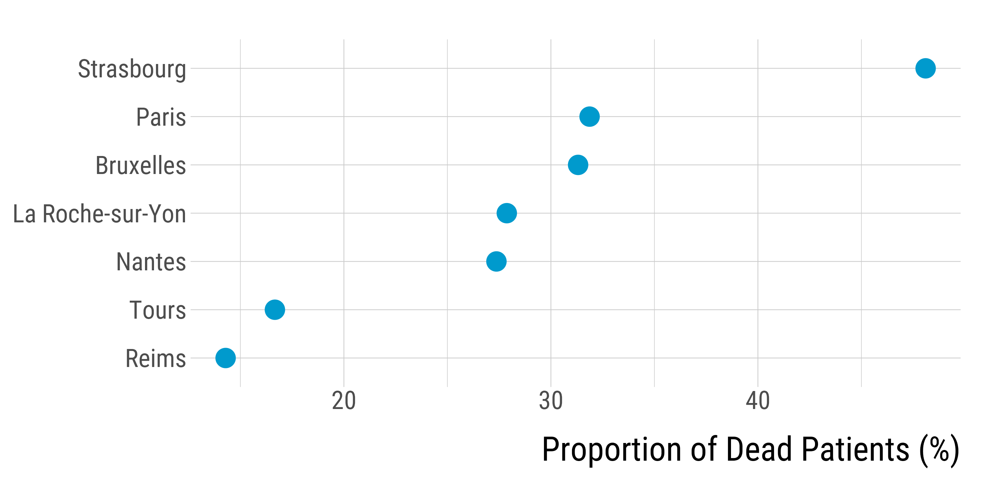
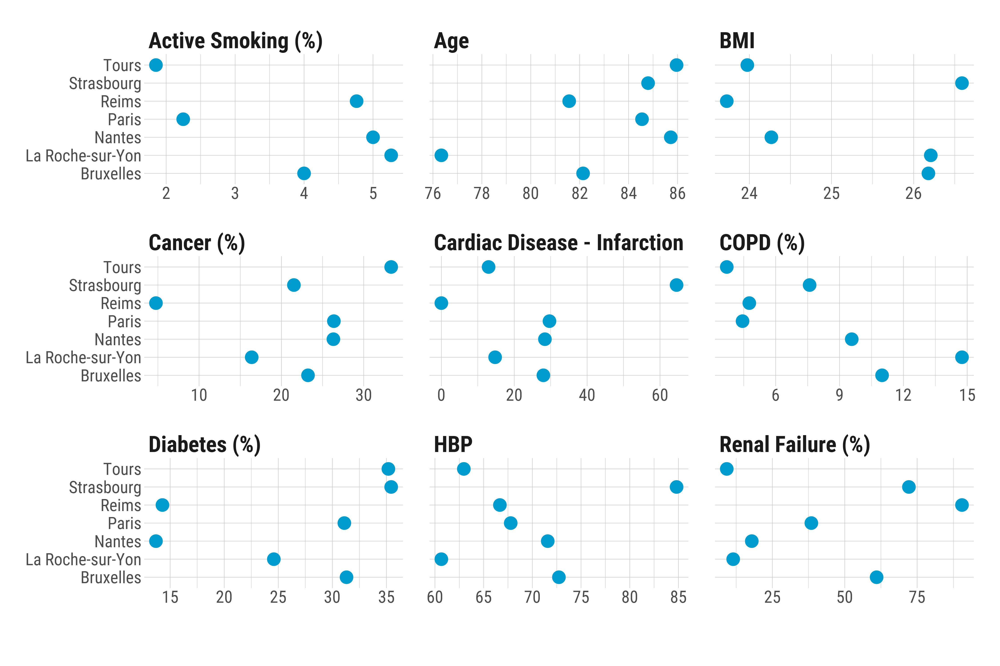
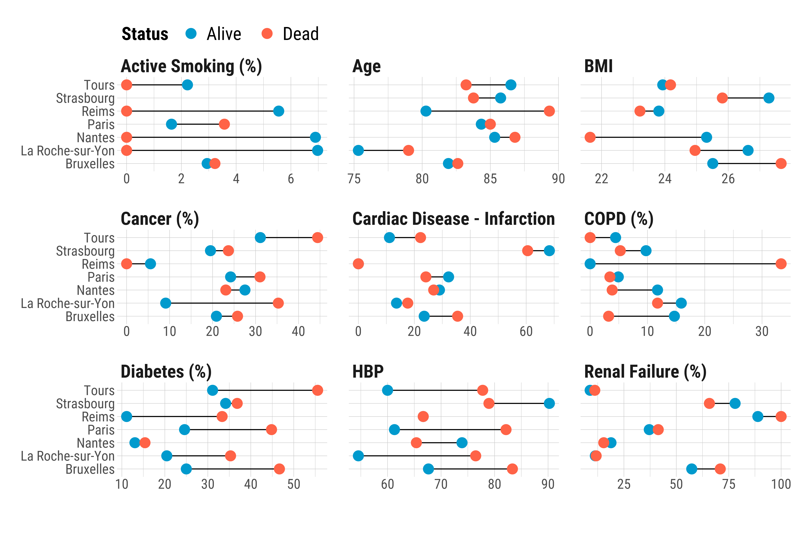
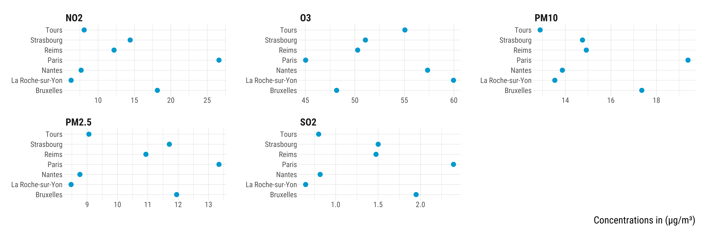
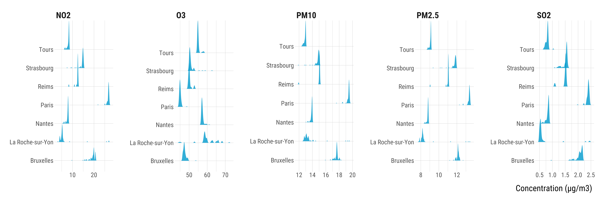
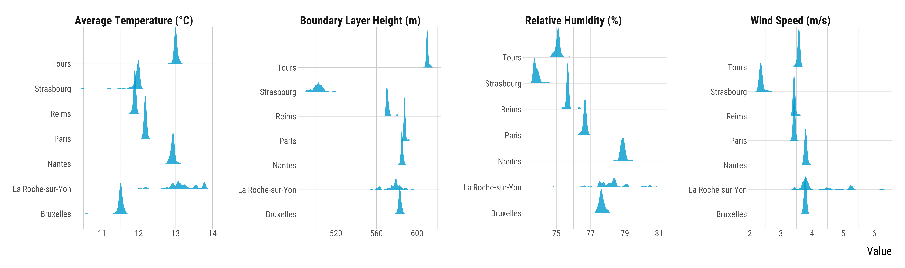
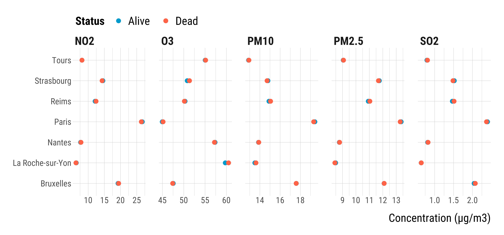
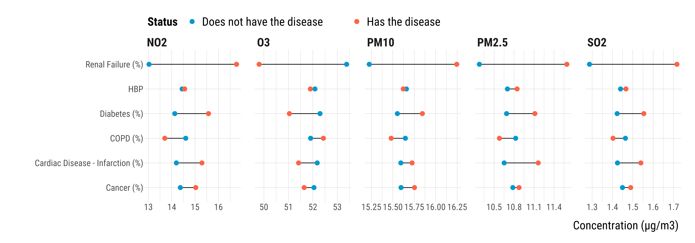

<style>
body {
text-align: justify}
</style>


In this script, we explore patients' health data and their air pollution exposure. Should you have any questions or find coding errors, please do not hesitate to reach me at **leo.zabrocki@psemail.eu**.

# Required Packages and Loading Data

### Required Packages

To reproduce exactly the `script_eda.html` document, you first need to have installed:

* the [R](https://www.r-project.org/) programming language on your computer 
* [RStudio](https://rstudio.com/), an integrated development environment for R, which will allow you to knit the `script_eda.Rmd` file and interact with the R code chunks
* the [R Markdown](https://rmarkdown.rstudio.com/) package
* and the [Distill](https://rstudio.github.io/distill/) package which provides the template of this document. 

Once everything is set up, we need to load the following packages:

<div class="layout-chunk" data-layout="l-body-outset">
<div class="sourceCode"><pre class="sourceCode r"><code class="sourceCode r"><span class='co'># load required packages</span>
<span class='kw'><a href='https://rdrr.io/r/base/library.html'>library</a></span><span class='op'>(</span><span class='va'><a href='https://github.com/rstudio/rmarkdown'>rmarkdown</a></span><span class='op'>)</span> <span class='co'># for creating the R Markdown document</span>
<span class='kw'><a href='https://rdrr.io/r/base/library.html'>library</a></span><span class='op'>(</span><span class='va'><a href='https://yihui.org/knitr/'>knitr</a></span><span class='op'>)</span> <span class='co'># for creating the R Markdown document</span>
<span class='kw'><a href='https://rdrr.io/r/base/library.html'>library</a></span><span class='op'>(</span><span class='va'><a href='https://here.r-lib.org/'>here</a></span><span class='op'>)</span> <span class='co'># for files paths organization</span>
<span class='kw'><a href='https://rdrr.io/r/base/library.html'>library</a></span><span class='op'>(</span><span class='va'><a href='https://tidyverse.tidyverse.org'>tidyverse</a></span><span class='op'>)</span> <span class='co'># for data manipulation and visualization</span>
<span class='kw'><a href='https://rdrr.io/r/base/library.html'>library</a></span><span class='op'>(</span><span class='va'><a href='https://lubridate.tidyverse.org'>lubridate</a></span><span class='op'>)</span> <span class='co'># for manipulating date variables</span>
<span class='kw'><a href='https://rdrr.io/r/base/library.html'>library</a></span><span class='op'>(</span><span class='va'><a href='https://wilkelab.org/ggridges/'>ggridges</a></span><span class='op'>)</span> <span class='co'># for ridge density plots</span>
<span class='kw'><a href='https://rdrr.io/r/base/library.html'>library</a></span><span class='op'>(</span><span class='va'><a href='http://www.rforge.net/Cairo/'>Cairo</a></span><span class='op'>)</span> <span class='co'># for printing custom police of graphs</span>
</code></pre></div>

</div>


We also load our custom `ggplot2` theme for graphs:

<div class="layout-chunk" data-layout="l-body-outset">
<div class="sourceCode"><pre class="sourceCode r"><code class="sourceCode r"><span class='co'># load ggplot custom theme</span>
<span class='kw'><a href='https://rdrr.io/r/base/source.html'>source</a></span><span class='op'>(</span>
  <span class='fu'>here</span><span class='fu'>::</span><span class='fu'><a href='https://here.r-lib.org//reference/here.html'>here</a></span><span class='op'>(</span>
    <span class='st'>"2.scripts"</span>,
    <span class='st'>"4.custom_ggplot2_theme"</span>,
    <span class='st'>"script_custom_ggplot_theme.R"</span>
  <span class='op'>)</span>
<span class='op'>)</span>
</code></pre></div>

</div>


The theme is based on the fantastic [hrbrthemes](https://hrbrmstr.github.io/hrbrthemes/index.html) package. If you do not want to use this theme or are unable to install it because of fonts issues, you can use the `theme_mimimal()` included in the `ggplot2` package.

### Data Loading

We load the data we use in our analysis:

<div class="layout-chunk" data-layout="l-body-outset">
<div class="sourceCode"><pre class="sourceCode r"><code class="sourceCode r"><span class='va'>data</span> <span class='op'>&lt;-</span>
  <span class='fu'><a href='https://rdrr.io/r/base/readRDS.html'>readRDS</a></span><span class='op'>(</span><span class='fu'>here</span><span class='fu'>::</span><span class='fu'><a href='https://here.r-lib.org//reference/here.html'>here</a></span><span class='op'>(</span><span class='st'>"1.data"</span>, <span class='st'>"3.data_for_analysis"</span>, <span class='st'>"data_analysis.rds"</span><span class='op'>)</span><span class='op'>)</span> <span class='op'>%&gt;%</span>
  <span class='fu'><a href='https://rdrr.io/r/stats/filter.html'>filter</a></span><span class='op'>(</span><span class='va'>covid</span> <span class='op'>==</span> <span class='fl'>1</span><span class='op'>)</span>
</code></pre></div>

</div>


There are 501 observations and 298 variables. 

# Missing Data

I first display below the number of patients by city:

<div class="layout-chunk" data-layout="l-body-outset">
<div class="sourceCode"><pre class="sourceCode r"><code class="sourceCode r"><span class='co'># make the table</span>
<span class='va'>data_n_obs_city</span> <span class='op'>&lt;-</span> <span class='va'>data</span> <span class='op'>%&gt;%</span>
  
  <span class='fu'>rename</span><span class='op'>(</span>City <span class='op'>=</span> <span class='va'>city</span><span class='op'>)</span> <span class='op'>%&gt;%</span>
  <span class='fu'>group_by</span><span class='op'>(</span><span class='va'>City</span><span class='op'>)</span> <span class='op'>%&gt;%</span>
  <span class='fu'>summarise</span><span class='op'>(</span><span class='st'>"Number of Patients"</span> <span class='op'>=</span> <span class='fu'>n</span><span class='op'>(</span><span class='op'>)</span><span class='op'>)</span>

<span class='co'># print the table</span>
<span class='va'>data_n_obs_city</span> <span class='op'>%&gt;%</span>
  <span class='fu'><a href='https://rdrr.io/pkg/knitr/man/kable.html'>kable</a></span><span class='op'>(</span>align <span class='op'>=</span> <span class='fu'><a href='https://rdrr.io/r/base/c.html'>c</a></span><span class='op'>(</span><span class='st'>"l"</span>, <span class='st'>"c"</span><span class='op'>)</span><span class='op'>)</span>
</code></pre></div>


|City             | Number of Patients |
|:----------------|:------------------:|
|Bruxelles        |        100         |
|La Roche-sur-Yon |         61         |
|Nantes           |         95         |
|Paris            |         91         |
|Reims            |         21         |
|Strasbourg       |         79         |
|Tours            |         54         |

<div class="sourceCode"><pre class="sourceCode r"><code class="sourceCode r"><span class='co'># save the table</span>
<span class='fu'><a href='https://rdrr.io/r/utils/write.table.html'>write.csv</a></span><span class='op'>(</span>
  <span class='va'>data_n_obs_city</span>,
  <span class='fu'>here</span><span class='fu'>::</span><span class='fu'><a href='https://here.r-lib.org//reference/here.html'>here</a></span><span class='op'>(</span><span class='st'>"3.outputs"</span>, <span class='st'>"2.tables"</span>, <span class='st'>"0.eda"</span>, <span class='st'>"table_n_obs_city.csv"</span><span class='op'>)</span>
<span class='op'>)</span>
</code></pre></div>

</div>


I then display the proportion of missing data for each variable:

<div class="layout-chunk" data-layout="l-body-outset">
<div class="sourceCode"><pre class="sourceCode r"><code class="sourceCode r"><span class='co'># make the table</span>
<span class='va'>data_missing</span> <span class='op'>&lt;-</span> <span class='va'>data</span> <span class='op'>%&gt;%</span>
  <span class='fu'>pivot_longer</span><span class='op'>(</span>
    cols <span class='op'>=</span> <span class='fu'><a href='https://rdrr.io/r/base/c.html'>c</a></span><span class='op'>(</span>
      <span class='va'>covid</span>,
      <span class='va'>dead</span>,
      <span class='va'>age</span>,
      <span class='va'>diabetes</span>,
      <span class='va'>active_smoking</span>,
      <span class='va'>hbp</span>,
      <span class='va'>cardiac_disease_infarction</span>,
      <span class='va'>copd</span>,
      <span class='va'>renal_failure</span>,
      <span class='va'>cancer</span>,
      <span class='va'>bmi</span>
    <span class='op'>)</span>,
    names_to <span class='op'>=</span> <span class='st'>"Variable"</span>,
    values_to <span class='op'>=</span> <span class='st'>"value"</span>
  <span class='op'>)</span> <span class='op'>%&gt;%</span>
  <span class='fu'>mutate</span><span class='op'>(</span>
    Variable <span class='op'>=</span> <span class='fu'>case_when</span><span class='op'>(</span>
      <span class='va'>Variable</span> <span class='op'>==</span> <span class='st'>"covid"</span> <span class='op'>~</span> <span class='st'>"COVID"</span>,
      <span class='va'>Variable</span> <span class='op'>==</span> <span class='st'>"dead"</span> <span class='op'>~</span> <span class='st'>"Dead"</span>,
      <span class='va'>Variable</span> <span class='op'>==</span> <span class='st'>"age"</span> <span class='op'>~</span> <span class='st'>"Age"</span>,
      <span class='va'>Variable</span> <span class='op'>==</span> <span class='st'>"bmi"</span> <span class='op'>~</span> <span class='st'>"BMI"</span>,
      <span class='va'>Variable</span> <span class='op'>==</span> <span class='st'>"active_smoking"</span> <span class='op'>~</span> <span class='st'>"Active Smoking"</span>,
      <span class='va'>Variable</span> <span class='op'>==</span> <span class='st'>"active_past_smoking"</span> <span class='op'>~</span> <span class='st'>"Active or Past Smoking"</span>,
      <span class='va'>Variable</span> <span class='op'>==</span> <span class='st'>"hbp"</span> <span class='op'>~</span> <span class='st'>"HBP"</span>,
      <span class='va'>Variable</span> <span class='op'>==</span> <span class='st'>"diabetes"</span> <span class='op'>~</span> <span class='st'>"Diabetes"</span>,
      <span class='va'>Variable</span> <span class='op'>==</span> <span class='st'>"cardiac_disease_infarction"</span> <span class='op'>~</span> <span class='st'>"Cardiac Disease Infarction"</span>,
      <span class='va'>Variable</span> <span class='op'>==</span> <span class='st'>"copd"</span> <span class='op'>~</span> <span class='st'>"COPD"</span>,
      <span class='va'>Variable</span> <span class='op'>==</span> <span class='st'>"renal_failure"</span> <span class='op'>~</span> <span class='st'>"Renal Failure"</span>,
      <span class='va'>Variable</span> <span class='op'>==</span> <span class='st'>"cancer"</span> <span class='op'>~</span> <span class='st'>"Cancer"</span>
    <span class='op'>)</span>
  <span class='op'>)</span> <span class='op'>%&gt;%</span>
  <span class='fu'>group_by</span><span class='op'>(</span><span class='va'>Variable</span><span class='op'>)</span> <span class='op'>%&gt;%</span>
  <span class='fu'>summarise</span><span class='op'>(</span><span class='st'>"Missing (%)"</span> <span class='op'>=</span> <span class='fu'><a href='https://rdrr.io/r/base/Round.html'>round</a></span><span class='op'>(</span><span class='fu'><a href='https://rdrr.io/r/base/sum.html'>sum</a></span><span class='op'>(</span><span class='fu'><a href='https://rdrr.io/r/base/NA.html'>is.na</a></span><span class='op'>(</span><span class='va'>value</span><span class='op'>)</span><span class='op'>)</span> <span class='op'>/</span> <span class='fu'>n</span><span class='op'>(</span><span class='op'>)</span> <span class='op'>*</span> <span class='fl'>100</span>, <span class='fl'>1</span><span class='op'>)</span><span class='op'>)</span>

<span class='co'># print the table</span>
<span class='va'>data_missing</span> <span class='op'>%&gt;%</span>
  <span class='fu'>arrange</span><span class='op'>(</span><span class='op'>-</span><span class='va'>`Missing (%)`</span><span class='op'>)</span> <span class='op'>%&gt;%</span>
  <span class='fu'><a href='https://rdrr.io/pkg/knitr/man/kable.html'>kable</a></span><span class='op'>(</span>align <span class='op'>=</span> <span class='fu'><a href='https://rdrr.io/r/base/c.html'>c</a></span><span class='op'>(</span><span class='st'>"l"</span>, <span class='st'>"c"</span><span class='op'>)</span><span class='op'>)</span>
</code></pre></div>


|Variable                   | Missing (%) |
|:--------------------------|:-----------:|
|BMI                        |    28.1     |
|Active Smoking             |    27.9     |
|COPD                       |     0.4     |
|Diabetes                   |     0.4     |
|HBP                        |     0.4     |
|Cancer                     |     0.2     |
|Dead                       |     0.2     |
|Age                        |     0.0     |
|Cardiac Disease Infarction |     0.0     |
|COVID                      |     0.0     |
|Renal Failure              |     0.0     |

<div class="sourceCode"><pre class="sourceCode r"><code class="sourceCode r"><span class='co'># save the table</span>
<span class='fu'><a href='https://rdrr.io/r/utils/write.table.html'>write.csv</a></span><span class='op'>(</span>
  <span class='va'>data_missing</span>,
  <span class='fu'>here</span><span class='fu'>::</span><span class='fu'><a href='https://here.r-lib.org//reference/here.html'>here</a></span><span class='op'>(</span><span class='st'>"3.outputs"</span>, <span class='st'>"2.tables"</span>, <span class='st'>"0.eda"</span>, <span class='st'>"table_missing_data.csv"</span><span class='op'>)</span>
<span class='op'>)</span>
</code></pre></div>

</div>


# Health Status

### Proportion of Dead Patients

We plot the proportion of COVID positive patients who died by city:

<div class="layout-chunk" data-layout="l-body-outset">
<div class="sourceCode"><pre class="sourceCode r"><code class="sourceCode r"><span class='co'># make the graph</span>
<span class='va'>graph_dead_city</span> <span class='op'>&lt;-</span> <span class='va'>data</span> <span class='op'>%&gt;%</span>
  <span class='fu'>group_by</span><span class='op'>(</span><span class='va'>city</span><span class='op'>)</span> <span class='op'>%&gt;%</span>
  <span class='fu'>summarise</span><span class='op'>(</span>proportion_dead <span class='op'>=</span> <span class='fu'><a href='https://rdrr.io/r/base/mean.html'>mean</a></span><span class='op'>(</span><span class='va'>dead</span>, na.rm <span class='op'>=</span> <span class='cn'>TRUE</span><span class='op'>)</span> <span class='op'>*</span> <span class='fl'>100</span><span class='op'>)</span> <span class='op'>%&gt;%</span>
  <span class='fu'>ggplot</span><span class='op'>(</span><span class='va'>.</span>, <span class='fu'>aes</span><span class='op'>(</span>x <span class='op'>=</span> <span class='va'>proportion_dead</span>, y <span class='op'>=</span> <span class='fu'><a href='https://rdrr.io/r/stats/reorder.factor.html'>reorder</a></span><span class='op'>(</span><span class='va'>city</span>, <span class='va'>proportion_dead</span><span class='op'>)</span><span class='op'>)</span><span class='op'>)</span> <span class='op'>+</span>
  <span class='fu'>geom_point</span><span class='op'>(</span>size <span class='op'>=</span> <span class='fl'>6</span>, color <span class='op'>=</span> <span class='st'>"deepskyblue3"</span><span class='op'>)</span> <span class='op'>+</span>
  <span class='fu'>xlab</span><span class='op'>(</span><span class='st'>"Proportion of Dead Patients (%)"</span><span class='op'>)</span> <span class='op'>+</span> <span class='fu'>ylab</span><span class='op'>(</span><span class='st'>""</span><span class='op'>)</span> <span class='op'>+</span>
  <span class='va'>custom_theme</span> <span class='op'>+</span>
  <span class='fu'>theme</span><span class='op'>(</span>plot.margin <span class='op'>=</span> <span class='fu'>unit</span><span class='op'>(</span><span class='fu'><a href='https://rdrr.io/r/base/c.html'>c</a></span><span class='op'>(</span><span class='fl'>1</span>, <span class='fl'>1</span>, <span class='fl'>1</span>, <span class='op'>-</span><span class='fl'>1</span><span class='op'>)</span>, <span class='st'>"cm"</span><span class='op'>)</span><span class='op'>)</span>

<span class='co'># print the graph</span>
<span class='va'>graph_dead_city</span>
</code></pre></div>
<!-- --><div class="sourceCode"><pre class="sourceCode r"><code class="sourceCode r"><span class='co'># save graph</span>
<span class='fu'>ggsave</span><span class='op'>(</span>
  <span class='va'>graph_dead_city</span>,
  filename <span class='op'>=</span> <span class='fu'>here</span><span class='fu'>::</span><span class='fu'><a href='https://here.r-lib.org//reference/here.html'>here</a></span><span class='op'>(</span><span class='st'>"3.outputs"</span>, <span class='st'>"1.figures"</span>, <span class='st'>"0.eda"</span>, <span class='st'>"graph_dead_city.pdf"</span><span class='op'>)</span>,
  width <span class='op'>=</span> <span class='fl'>30</span>,
  height <span class='op'>=</span> <span class='fl'>15</span>,
  units <span class='op'>=</span> <span class='st'>"cm"</span>,
  device <span class='op'>=</span> <span class='va'>cairo_pdf</span>
<span class='op'>)</span>
</code></pre></div>

</div>


### Characteristics of Patients by City

We plot the characteristics of all COVID positive patients by city:

<div class="layout-chunk" data-layout="l-body-outset">
<div class="sourceCode"><pre class="sourceCode r"><code class="sourceCode r"><span class='co'># make the graph</span>
<span class='va'>graph_characteristics_patients</span> <span class='op'>&lt;-</span> <span class='va'>data</span> <span class='op'>%&gt;%</span>
  <span class='fu'>pivot_longer</span><span class='op'>(</span>
    cols <span class='op'>=</span> <span class='fu'><a href='https://rdrr.io/r/base/c.html'>c</a></span><span class='op'>(</span>
      <span class='va'>age</span>,
      <span class='va'>diabetes</span>,
      <span class='va'>active_smoking</span>,
      <span class='va'>hbp</span>,
      <span class='va'>cardiac_disease_infarction</span>,
      <span class='va'>copd</span>,
      <span class='va'>renal_failure</span>,
      <span class='va'>cancer</span>,
      <span class='va'>bmi</span>
    <span class='op'>)</span>,
    names_to <span class='op'>=</span> <span class='st'>"covariate"</span>,
    values_to <span class='op'>=</span> <span class='st'>"value"</span>
  <span class='op'>)</span> <span class='op'>%&gt;%</span>
  <span class='fu'>mutate</span><span class='op'>(</span>
    covariate <span class='op'>=</span> <span class='fu'>case_when</span><span class='op'>(</span>
      <span class='va'>covariate</span> <span class='op'>==</span> <span class='st'>"age"</span> <span class='op'>~</span> <span class='st'>"Age"</span>,
      <span class='va'>covariate</span> <span class='op'>==</span> <span class='st'>"diabetes"</span> <span class='op'>~</span> <span class='st'>"Diabetes (%)"</span>,
      <span class='va'>covariate</span> <span class='op'>==</span> <span class='st'>"active_smoking"</span> <span class='op'>~</span> <span class='st'>"Active Smoking (%)"</span>,
      <span class='va'>covariate</span> <span class='op'>==</span> <span class='st'>"hbp"</span> <span class='op'>~</span> <span class='st'>"HBP"</span>,
      <span class='va'>covariate</span> <span class='op'>==</span> <span class='st'>"cardiac_disease_infarction"</span> <span class='op'>~</span> <span class='st'>"Cardiac Disease - Infarction (%)"</span>,
      <span class='va'>covariate</span> <span class='op'>==</span> <span class='st'>"copd"</span> <span class='op'>~</span> <span class='st'>"COPD (%)"</span>,
      <span class='va'>covariate</span> <span class='op'>==</span> <span class='st'>"renal_failure"</span> <span class='op'>~</span> <span class='st'>"Renal Failure (%)"</span>,
      <span class='va'>covariate</span> <span class='op'>==</span> <span class='st'>"cancer"</span> <span class='op'>~</span> <span class='st'>"Cancer (%)"</span>,
      <span class='va'>covariate</span> <span class='op'>==</span> <span class='st'>"bmi"</span> <span class='op'>~</span> <span class='st'>"BMI"</span>
    <span class='op'>)</span>
  <span class='op'>)</span> <span class='op'>%&gt;%</span>
  <span class='fu'>group_by</span><span class='op'>(</span><span class='va'>city</span>, <span class='va'>covariate</span><span class='op'>)</span> <span class='op'>%&gt;%</span>
  <span class='fu'>summarise</span><span class='op'>(</span>mean_value <span class='op'>=</span> <span class='fu'><a href='https://rdrr.io/r/base/mean.html'>mean</a></span><span class='op'>(</span><span class='va'>value</span>, na.rm <span class='op'>=</span> <span class='cn'>TRUE</span><span class='op'>)</span><span class='op'>)</span> <span class='op'>%&gt;%</span>
  <span class='fu'>mutate</span><span class='op'>(</span>mean_value <span class='op'>=</span> <span class='fu'><a href='https://rdrr.io/r/base/ifelse.html'>ifelse</a></span><span class='op'>(</span><span class='op'>!</span><span class='op'>(</span><span class='va'>covariate</span> <span class='op'>%in%</span> <span class='fu'><a href='https://rdrr.io/r/base/c.html'>c</a></span><span class='op'>(</span><span class='st'>"Age"</span>, <span class='st'>"BMI"</span><span class='op'>)</span><span class='op'>)</span>, <span class='va'>mean_value</span> <span class='op'>*</span>
                               <span class='fl'>100</span>, <span class='va'>mean_value</span><span class='op'>)</span><span class='op'>)</span> <span class='op'>%&gt;%</span>
  <span class='fu'>ggplot</span><span class='op'>(</span><span class='va'>.</span>, <span class='fu'>aes</span><span class='op'>(</span>x <span class='op'>=</span> <span class='va'>mean_value</span>, y <span class='op'>=</span> <span class='va'>city</span><span class='op'>)</span><span class='op'>)</span> <span class='op'>+</span>
  <span class='fu'>geom_point</span><span class='op'>(</span>size <span class='op'>=</span> <span class='fl'>6</span>, colour <span class='op'>=</span> <span class='st'>"deepskyblue3"</span><span class='op'>)</span> <span class='op'>+</span>
  <span class='fu'>facet_wrap</span><span class='op'>(</span> <span class='op'>~</span> <span class='va'>covariate</span>, scales <span class='op'>=</span> <span class='st'>"free_x"</span>, ncol <span class='op'>=</span> <span class='fl'>3</span><span class='op'>)</span> <span class='op'>+</span>
  <span class='fu'>xlab</span><span class='op'>(</span><span class='st'>""</span><span class='op'>)</span> <span class='op'>+</span> <span class='fu'>ylab</span><span class='op'>(</span><span class='st'>""</span><span class='op'>)</span> <span class='op'>+</span>
  <span class='va'>custom_theme</span> <span class='op'>+</span>
  <span class='fu'>theme</span><span class='op'>(</span>plot.margin <span class='op'>=</span> <span class='fu'>unit</span><span class='op'>(</span><span class='fu'><a href='https://rdrr.io/r/base/c.html'>c</a></span><span class='op'>(</span><span class='fl'>1</span>, <span class='fl'>1</span>, <span class='fl'>1</span>, <span class='op'>-</span><span class='fl'>1</span><span class='op'>)</span>, <span class='st'>"cm"</span><span class='op'>)</span><span class='op'>)</span>

<span class='co'># print the graph</span>
<span class='va'>graph_characteristics_patients</span>
</code></pre></div>
<!-- --><div class="sourceCode"><pre class="sourceCode r"><code class="sourceCode r"><span class='co'># save graph</span>
<span class='fu'>ggsave</span><span class='op'>(</span>
  <span class='va'>graph_characteristics_patients</span>,
  filename <span class='op'>=</span> <span class='fu'>here</span><span class='fu'>::</span><span class='fu'><a href='https://here.r-lib.org//reference/here.html'>here</a></span><span class='op'>(</span>
    <span class='st'>"3.outputs"</span>,
    <span class='st'>"1.figures"</span>,
    <span class='st'>"0.eda"</span>,
    <span class='st'>"graph_characteristics_patients.pdf"</span>
  <span class='op'>)</span>,
  width <span class='op'>=</span> <span class='fl'>50</span>,
  height <span class='op'>=</span> <span class='fl'>40</span>,
  units <span class='op'>=</span> <span class='st'>"cm"</span>,
  device <span class='op'>=</span> <span class='va'>cairo_pdf</span>
<span class='op'>)</span>
</code></pre></div>

</div>


### Characteristics of Dead Patients

We plot the characteristics of all COVID positive patients who died by city:

<div class="layout-chunk" data-layout="l-body-outset">
<div class="sourceCode"><pre class="sourceCode r"><code class="sourceCode r"><span class='co'># make the graph</span>
<span class='va'>graph_characteristics_patients_mortality_outcome</span> <span class='op'>&lt;-</span> <span class='va'>data</span> <span class='op'>%&gt;%</span>
  <span class='fu'><a href='https://rdrr.io/r/stats/filter.html'>filter</a></span><span class='op'>(</span><span class='op'>!</span><span class='fu'><a href='https://rdrr.io/r/base/NA.html'>is.na</a></span><span class='op'>(</span><span class='va'>dead</span><span class='op'>)</span><span class='op'>)</span> <span class='op'>%&gt;%</span>
  <span class='fu'>pivot_longer</span><span class='op'>(</span>
    cols <span class='op'>=</span> <span class='fu'><a href='https://rdrr.io/r/base/c.html'>c</a></span><span class='op'>(</span>
      <span class='va'>age</span>,
      <span class='va'>diabetes</span>,
      <span class='va'>active_smoking</span>,
      <span class='va'>hbp</span>,
      <span class='va'>cardiac_disease_infarction</span>,
      <span class='va'>copd</span>,
      <span class='va'>renal_failure</span>,
      <span class='va'>cancer</span>,
      <span class='va'>bmi</span>
    <span class='op'>)</span>,
    names_to <span class='op'>=</span> <span class='st'>"covariate"</span>,
    values_to <span class='op'>=</span> <span class='st'>"value"</span>
  <span class='op'>)</span> <span class='op'>%&gt;%</span>
  <span class='fu'>mutate</span><span class='op'>(</span>
    covariate <span class='op'>=</span> <span class='fu'>case_when</span><span class='op'>(</span>
      <span class='va'>covariate</span> <span class='op'>==</span> <span class='st'>"age"</span> <span class='op'>~</span> <span class='st'>"Age"</span>,
      <span class='va'>covariate</span> <span class='op'>==</span> <span class='st'>"diabetes"</span> <span class='op'>~</span> <span class='st'>"Diabetes (%)"</span>,
      <span class='va'>covariate</span> <span class='op'>==</span> <span class='st'>"active_smoking"</span> <span class='op'>~</span> <span class='st'>"Active Smoking (%)"</span>,
      <span class='va'>covariate</span> <span class='op'>==</span> <span class='st'>"hbp"</span> <span class='op'>~</span> <span class='st'>"HBP"</span>,
      <span class='va'>covariate</span> <span class='op'>==</span> <span class='st'>"cardiac_disease_infarction"</span> <span class='op'>~</span> <span class='st'>"Cardiac Disease - Infarction (%)"</span>,
      <span class='va'>covariate</span> <span class='op'>==</span> <span class='st'>"copd"</span> <span class='op'>~</span> <span class='st'>"COPD (%)"</span>,
      <span class='va'>covariate</span> <span class='op'>==</span> <span class='st'>"renal_failure"</span> <span class='op'>~</span> <span class='st'>"Renal Failure (%)"</span>,
      <span class='va'>covariate</span> <span class='op'>==</span> <span class='st'>"cancer"</span> <span class='op'>~</span> <span class='st'>"Cancer (%)"</span>,
      <span class='va'>covariate</span> <span class='op'>==</span> <span class='st'>"bmi"</span> <span class='op'>~</span> <span class='st'>"BMI"</span>
    <span class='op'>)</span>
  <span class='op'>)</span> <span class='op'>%&gt;%</span>
  <span class='fu'>mutate</span><span class='op'>(</span>dead <span class='op'>=</span> <span class='fu'><a href='https://rdrr.io/r/base/ifelse.html'>ifelse</a></span><span class='op'>(</span><span class='va'>dead</span> <span class='op'>==</span> <span class='fl'>1</span>, <span class='st'>"Dead"</span>, <span class='st'>"Alive"</span><span class='op'>)</span><span class='op'>)</span> <span class='op'>%&gt;%</span>
  <span class='fu'>group_by</span><span class='op'>(</span><span class='va'>city</span>, <span class='va'>dead</span>, <span class='va'>covariate</span><span class='op'>)</span> <span class='op'>%&gt;%</span>
  <span class='fu'>summarise</span><span class='op'>(</span>mean_value <span class='op'>=</span> <span class='fu'><a href='https://rdrr.io/r/base/mean.html'>mean</a></span><span class='op'>(</span><span class='va'>value</span>, na.rm <span class='op'>=</span> <span class='cn'>TRUE</span><span class='op'>)</span><span class='op'>)</span> <span class='op'>%&gt;%</span>
  <span class='fu'>mutate</span><span class='op'>(</span>mean_value <span class='op'>=</span> <span class='fu'><a href='https://rdrr.io/r/base/ifelse.html'>ifelse</a></span><span class='op'>(</span><span class='op'>!</span><span class='op'>(</span><span class='va'>covariate</span> <span class='op'>%in%</span> <span class='fu'><a href='https://rdrr.io/r/base/c.html'>c</a></span><span class='op'>(</span><span class='st'>"Age"</span>, <span class='st'>"BMI"</span><span class='op'>)</span><span class='op'>)</span>, <span class='va'>mean_value</span> <span class='op'>*</span>
                               <span class='fl'>100</span>, <span class='va'>mean_value</span><span class='op'>)</span><span class='op'>)</span> <span class='op'>%&gt;%</span>
  <span class='fu'>ggplot</span><span class='op'>(</span><span class='va'>.</span>, <span class='fu'>aes</span><span class='op'>(</span>x <span class='op'>=</span> <span class='va'>mean_value</span>, y <span class='op'>=</span> <span class='va'>city</span><span class='op'>)</span><span class='op'>)</span> <span class='op'>+</span>
  <span class='fu'>geom_line</span><span class='op'>(</span><span class='fu'>aes</span><span class='op'>(</span>group <span class='op'>=</span> <span class='va'>city</span><span class='op'>)</span>, colour <span class='op'>=</span> <span class='st'>"black"</span><span class='op'>)</span> <span class='op'>+</span>
  <span class='fu'>geom_point</span><span class='op'>(</span><span class='fu'>aes</span><span class='op'>(</span>colour <span class='op'>=</span> <span class='va'>dead</span><span class='op'>)</span>, size <span class='op'>=</span> <span class='fl'>6</span><span class='op'>)</span> <span class='op'>+</span>
  <span class='fu'>scale_colour_manual</span><span class='op'>(</span>values <span class='op'>=</span> <span class='fu'><a href='https://rdrr.io/r/base/c.html'>c</a></span><span class='op'>(</span><span class='st'>"deepskyblue3"</span>, <span class='st'>"tomato"</span><span class='op'>)</span><span class='op'>)</span> <span class='op'>+</span>
  <span class='fu'>facet_wrap</span><span class='op'>(</span> <span class='op'>~</span> <span class='va'>covariate</span>, scales <span class='op'>=</span> <span class='st'>"free_x"</span>, ncol <span class='op'>=</span> <span class='fl'>3</span><span class='op'>)</span> <span class='op'>+</span>
  <span class='fu'>xlab</span><span class='op'>(</span><span class='st'>""</span><span class='op'>)</span> <span class='op'>+</span> <span class='fu'>ylab</span><span class='op'>(</span><span class='st'>""</span><span class='op'>)</span> <span class='op'>+</span>
  <span class='va'>custom_theme</span> <span class='op'>+</span>
  <span class='fu'>labs</span><span class='op'>(</span>colour <span class='op'>=</span> <span class='st'>"Status"</span><span class='op'>)</span> <span class='op'>+</span>
  <span class='fu'>theme</span><span class='op'>(</span>
    legend.position <span class='op'>=</span> <span class='st'>"top"</span>,
    legend.justification <span class='op'>=</span> <span class='st'>"left"</span>,
    legend.direction <span class='op'>=</span> <span class='st'>"horizontal"</span>,
    plot.margin <span class='op'>=</span> <span class='fu'>unit</span><span class='op'>(</span><span class='fu'><a href='https://rdrr.io/r/base/c.html'>c</a></span><span class='op'>(</span><span class='fl'>1</span>, <span class='fl'>1</span>, <span class='fl'>1</span>, <span class='op'>-</span><span class='fl'>1</span><span class='op'>)</span>, <span class='st'>"cm"</span><span class='op'>)</span>
  <span class='op'>)</span>

<span class='co'># print the graph</span>
<span class='va'>graph_characteristics_patients_mortality_outcome</span>
</code></pre></div>
<!-- --><div class="sourceCode"><pre class="sourceCode r"><code class="sourceCode r"><span class='co'># save graph</span>
<span class='fu'>ggsave</span><span class='op'>(</span>
  <span class='va'>graph_characteristics_patients_mortality_outcome</span>,
  filename <span class='op'>=</span> <span class='fu'>here</span><span class='fu'>::</span><span class='fu'><a href='https://here.r-lib.org//reference/here.html'>here</a></span><span class='op'>(</span>
    <span class='st'>"3.outputs"</span>,
    <span class='st'>"1.figures"</span>,
    <span class='st'>"0.eda"</span>,
    <span class='st'>"graph_characteristics_patients_mortality_outcome.pdf"</span>
  <span class='op'>)</span>,
  width <span class='op'>=</span> <span class='fl'>50</span>,
  height <span class='op'>=</span> <span class='fl'>40</span>,
  units <span class='op'>=</span> <span class='st'>"cm"</span>,
  device <span class='op'>=</span> <span class='va'>cairo_pdf</span>
<span class='op'>)</span>
</code></pre></div>

</div>


# Exploring Air Pollution and Weather Exposures

### Mean of Air Pollutants by City

We plot the mean concentration of each pollutant by city:

<div class="layout-chunk" data-layout="l-body-outset">
<div class="sourceCode"><pre class="sourceCode r"><code class="sourceCode r"><span class='co'># make the graph</span>
<span class='va'>graph_mean_exposure_pollution</span> <span class='op'>&lt;-</span> <span class='va'>data</span> <span class='op'>%&gt;%</span>
  <span class='fu'>select</span><span class='op'>(</span><span class='va'>city</span>, <span class='va'>mean_2017_2019_no2</span><span class='op'>:</span><span class='va'>mean_2017_2019_so2</span><span class='op'>)</span> <span class='op'>%&gt;%</span>
  <span class='fu'>rename</span><span class='op'>(</span>
    <span class='st'>"NO2"</span> <span class='op'>=</span> <span class='va'>mean_2017_2019_no2</span>,
    <span class='st'>"O3"</span> <span class='op'>=</span> <span class='va'>mean_2017_2019_o3</span>,
    <span class='st'>"PM10"</span> <span class='op'>=</span> <span class='va'>mean_2017_2019_pm10</span>,
    <span class='st'>"PM2.5"</span> <span class='op'>=</span> <span class='va'>mean_2017_2019_pm2p5</span>,
    <span class='st'>"SO2"</span> <span class='op'>=</span> <span class='va'>mean_2017_2019_so2</span>
  <span class='op'>)</span> <span class='op'>%&gt;%</span>
  <span class='fu'>pivot_longer</span><span class='op'>(</span>cols <span class='op'>=</span> <span class='fu'><a href='https://rdrr.io/r/base/c.html'>c</a></span><span class='op'>(</span><span class='va'>NO2</span><span class='op'>:</span><span class='va'>`SO2`</span><span class='op'>)</span>,
               names_to <span class='op'>=</span> <span class='st'>"pollutant"</span>,
               values_to <span class='op'>=</span> <span class='st'>"concentration"</span><span class='op'>)</span> <span class='op'>%&gt;%</span>
  <span class='fu'>group_by</span><span class='op'>(</span><span class='va'>city</span>, <span class='va'>pollutant</span><span class='op'>)</span> <span class='op'>%&gt;%</span>
  <span class='fu'>summarise</span><span class='op'>(</span>mean_concentration <span class='op'>=</span> <span class='fu'><a href='https://rdrr.io/r/base/mean.html'>mean</a></span><span class='op'>(</span><span class='va'>concentration</span><span class='op'>)</span><span class='op'>)</span> <span class='op'>%&gt;%</span>
  <span class='fu'>ggplot</span><span class='op'>(</span><span class='va'>.</span>, <span class='fu'>aes</span><span class='op'>(</span>x <span class='op'>=</span> <span class='va'>mean_concentration</span>, y <span class='op'>=</span> <span class='va'>city</span><span class='op'>)</span><span class='op'>)</span> <span class='op'>+</span>
  <span class='fu'>geom_point</span><span class='op'>(</span>size <span class='op'>=</span> <span class='fl'>5</span>, color <span class='op'>=</span> <span class='st'>"deepskyblue3"</span><span class='op'>)</span> <span class='op'>+</span>
  <span class='fu'>facet_wrap</span><span class='op'>(</span> <span class='op'>~</span> <span class='va'>pollutant</span>, scales <span class='op'>=</span> <span class='st'>"free"</span>, nrow <span class='op'>=</span> <span class='fl'>2</span><span class='op'>)</span> <span class='op'>+</span>
  <span class='fu'>xlab</span><span class='op'>(</span><span class='st'>"Concentrations in (µg/m³)"</span><span class='op'>)</span> <span class='op'>+</span> <span class='fu'>ylab</span><span class='op'>(</span><span class='st'>""</span><span class='op'>)</span> <span class='op'>+</span>
  <span class='va'>custom_theme</span> <span class='op'>+</span>
  <span class='fu'>theme</span><span class='op'>(</span>plot.margin <span class='op'>=</span> <span class='fu'>unit</span><span class='op'>(</span><span class='fu'><a href='https://rdrr.io/r/base/c.html'>c</a></span><span class='op'>(</span><span class='fl'>1</span>, <span class='fl'>1</span>, <span class='fl'>1</span>, <span class='op'>-</span><span class='fl'>1</span><span class='op'>)</span>, <span class='st'>"cm"</span><span class='op'>)</span><span class='op'>)</span>

<span class='co'># print the graph</span>
<span class='va'>graph_mean_exposure_pollution</span>
</code></pre></div>
<!-- --><div class="sourceCode"><pre class="sourceCode r"><code class="sourceCode r"><span class='co'># save graph</span>
<span class='fu'>ggsave</span><span class='op'>(</span>
  <span class='va'>graph_mean_exposure_pollution</span>,
  filename <span class='op'>=</span> <span class='fu'>here</span><span class='fu'>::</span><span class='fu'><a href='https://here.r-lib.org//reference/here.html'>here</a></span><span class='op'>(</span>
    <span class='st'>"3.outputs"</span>,
    <span class='st'>"1.figures"</span>,
    <span class='st'>"0.eda"</span>,
    <span class='st'>"graph_mean_exposure_pollution.pdf"</span>
  <span class='op'>)</span>,
  width <span class='op'>=</span> <span class='fl'>40</span>,
  height <span class='op'>=</span> <span class='fl'>30</span>,
  units <span class='op'>=</span> <span class='st'>"cm"</span>,
  device <span class='op'>=</span> <span class='va'>cairo_pdf</span>
<span class='op'>)</span>
</code></pre></div>

</div>


### Air Pollutants Density Distributions

We plot the concentration distribution of each pollutant by city:

<div class="layout-chunk" data-layout="l-body-outset">
<div class="sourceCode"><pre class="sourceCode r"><code class="sourceCode r"><span class='co'># make the graph</span>
<span class='va'>graph_density_pollution_exposure</span> <span class='op'>&lt;-</span> <span class='va'>data</span> <span class='op'>%&gt;%</span>
  <span class='fu'>select</span><span class='op'>(</span><span class='va'>city</span>, <span class='va'>mean_2017_2019_no2</span><span class='op'>:</span><span class='va'>mean_2017_2019_so2</span><span class='op'>)</span> <span class='op'>%&gt;%</span>
  <span class='fu'>rename</span><span class='op'>(</span>
    <span class='st'>"NO2"</span> <span class='op'>=</span> <span class='va'>mean_2017_2019_no2</span>,
    <span class='st'>"O3"</span> <span class='op'>=</span> <span class='va'>mean_2017_2019_o3</span>,
    <span class='st'>"PM10"</span> <span class='op'>=</span> <span class='va'>mean_2017_2019_pm10</span>,
    <span class='st'>"PM2.5"</span> <span class='op'>=</span> <span class='va'>mean_2017_2019_pm2p5</span>,
    <span class='st'>"SO2"</span> <span class='op'>=</span> <span class='va'>mean_2017_2019_so2</span>
  <span class='op'>)</span> <span class='op'>%&gt;%</span>
  <span class='fu'>pivot_longer</span><span class='op'>(</span>cols <span class='op'>=</span> <span class='fu'><a href='https://rdrr.io/r/base/c.html'>c</a></span><span class='op'>(</span><span class='va'>NO2</span><span class='op'>:</span><span class='va'>`SO2`</span><span class='op'>)</span>,
               names_to <span class='op'>=</span> <span class='st'>"pollutant"</span>,
               values_to <span class='op'>=</span> <span class='st'>"concentration"</span><span class='op'>)</span> <span class='op'>%&gt;%</span>
  <span class='fu'>ggplot</span><span class='op'>(</span><span class='va'>.</span>, <span class='fu'>aes</span><span class='op'>(</span>x <span class='op'>=</span> <span class='va'>concentration</span>, y <span class='op'>=</span> <span class='va'>city</span><span class='op'>)</span><span class='op'>)</span> <span class='op'>+</span>
  <span class='fu'><a href='https://wilkelab.org/ggridges/reference/geom_density_ridges.html'>geom_density_ridges</a></span><span class='op'>(</span>colour <span class='op'>=</span> <span class='cn'>NA</span>,
                      fill <span class='op'>=</span> <span class='st'>"deepskyblue3"</span>,
                      alpha <span class='op'>=</span> <span class='fl'>0.8</span><span class='op'>)</span> <span class='op'>+</span>
  <span class='fu'>facet_wrap</span><span class='op'>(</span> <span class='op'>~</span> <span class='va'>pollutant</span>, scales <span class='op'>=</span> <span class='st'>"free"</span>, nrow <span class='op'>=</span> <span class='fl'>1</span><span class='op'>)</span> <span class='op'>+</span>
  <span class='fu'>xlab</span><span class='op'>(</span><span class='st'>"Concentration (µg/m3) "</span><span class='op'>)</span> <span class='op'>+</span> <span class='fu'>ylab</span><span class='op'>(</span><span class='st'>""</span><span class='op'>)</span> <span class='op'>+</span>
  <span class='va'>custom_theme</span> <span class='op'>+</span>
  <span class='fu'>theme</span><span class='op'>(</span>plot.margin <span class='op'>=</span> <span class='fu'>unit</span><span class='op'>(</span><span class='fu'><a href='https://rdrr.io/r/base/c.html'>c</a></span><span class='op'>(</span><span class='fl'>1</span>, <span class='fl'>1</span>, <span class='fl'>1</span>, <span class='op'>-</span><span class='fl'>1</span><span class='op'>)</span>, <span class='st'>"cm"</span><span class='op'>)</span><span class='op'>)</span>

<span class='co'># print the graph</span>
<span class='va'>graph_density_pollution_exposure</span>
</code></pre></div>
<!-- --><div class="sourceCode"><pre class="sourceCode r"><code class="sourceCode r"><span class='co'># save graph</span>
<span class='fu'>ggsave</span><span class='op'>(</span>
  <span class='va'>graph_density_pollution_exposure</span>,
  filename <span class='op'>=</span> <span class='fu'>here</span><span class='fu'>::</span><span class='fu'><a href='https://here.r-lib.org//reference/here.html'>here</a></span><span class='op'>(</span>
    <span class='st'>"3.outputs"</span>,
    <span class='st'>"1.figures"</span>,
    <span class='st'>"0.eda"</span>,
    <span class='st'>"graph_density_pollution_exposure.pdf"</span>
  <span class='op'>)</span>,
  width <span class='op'>=</span> <span class='fl'>70</span>,
  height <span class='op'>=</span> <span class='fl'>15</span>,
  units <span class='op'>=</span> <span class='st'>"cm"</span>,
  device <span class='op'>=</span> <span class='va'>cairo_pdf</span>
<span class='op'>)</span>
</code></pre></div>

</div>


### Weather Parameters Density Distributions

We plot the density distribution of each weather covariate by city:

<div class="layout-chunk" data-layout="l-body-outset">
<div class="sourceCode"><pre class="sourceCode r"><code class="sourceCode r"><span class='co'># make the graph</span>
<span class='va'>graph_density_exposure_weather</span> <span class='op'>&lt;-</span> <span class='va'>data</span> <span class='op'>%&gt;%</span>
  <span class='fu'>select</span><span class='op'>(</span><span class='va'>city</span>,
         <span class='va'>mean_2017_2019_average_temperature</span><span class='op'>:</span><span class='va'>mean_2017_2019_boundary_layer_height</span><span class='op'>)</span> <span class='op'>%&gt;%</span>
  <span class='fu'>rename</span><span class='op'>(</span>
    <span class='st'>"Average Temperature (°C)"</span> <span class='op'>=</span> <span class='va'>mean_2017_2019_average_temperature</span>,
    <span class='st'>"Wind Speed (m/s)"</span> <span class='op'>=</span> <span class='va'>mean_2017_2019_wind_speed</span>,
    <span class='st'>"Boundary Layer Height (m)"</span> <span class='op'>=</span> <span class='va'>mean_2017_2019_boundary_layer_height</span>,
    <span class='st'>"Relative Humidity (%)"</span> <span class='op'>=</span> <span class='va'>mean_2017_2019_relative_humidity</span>
  <span class='op'>)</span> <span class='op'>%&gt;%</span>
  <span class='fu'>pivot_longer</span><span class='op'>(</span>
    cols <span class='op'>=</span> <span class='fu'><a href='https://rdrr.io/r/base/c.html'>c</a></span><span class='op'>(</span><span class='va'>`Average Temperature (°C)`</span><span class='op'>:</span><span class='va'>`Boundary Layer Height (m)`</span><span class='op'>)</span>,
    names_to <span class='op'>=</span> <span class='st'>"weather_parameter"</span>,
    values_to <span class='op'>=</span> <span class='st'>"value"</span>
  <span class='op'>)</span> <span class='op'>%&gt;%</span>
  <span class='fu'>ggplot</span><span class='op'>(</span><span class='va'>.</span>, <span class='fu'>aes</span><span class='op'>(</span>x <span class='op'>=</span> <span class='va'>value</span>, y <span class='op'>=</span> <span class='va'>city</span><span class='op'>)</span><span class='op'>)</span> <span class='op'>+</span>
  <span class='fu'><a href='https://wilkelab.org/ggridges/reference/geom_density_ridges.html'>geom_density_ridges</a></span><span class='op'>(</span>colour <span class='op'>=</span> <span class='cn'>NA</span>,
                      fill <span class='op'>=</span> <span class='st'>"deepskyblue3"</span>,
                      alpha <span class='op'>=</span> <span class='fl'>0.8</span><span class='op'>)</span> <span class='op'>+</span>
  <span class='fu'>facet_wrap</span><span class='op'>(</span><span class='op'>~</span> <span class='va'>weather_parameter</span>, scales <span class='op'>=</span> <span class='st'>"free"</span>, nrow <span class='op'>=</span> <span class='fl'>1</span><span class='op'>)</span> <span class='op'>+</span>
  <span class='fu'>xlab</span><span class='op'>(</span><span class='st'>"Value"</span><span class='op'>)</span> <span class='op'>+</span> <span class='fu'>ylab</span><span class='op'>(</span><span class='st'>""</span><span class='op'>)</span> <span class='op'>+</span>
  <span class='va'>custom_theme</span> <span class='op'>+</span>
  <span class='fu'>theme</span><span class='op'>(</span>plot.margin <span class='op'>=</span> <span class='fu'>unit</span><span class='op'>(</span><span class='fu'><a href='https://rdrr.io/r/base/c.html'>c</a></span><span class='op'>(</span><span class='fl'>1</span>, <span class='fl'>1</span>, <span class='fl'>1</span>, <span class='op'>-</span><span class='fl'>1</span><span class='op'>)</span>, <span class='st'>"cm"</span><span class='op'>)</span><span class='op'>)</span>

<span class='co'># print the graph</span>
<span class='va'>graph_density_exposure_weather</span>
</code></pre></div>
<!-- --><div class="sourceCode"><pre class="sourceCode r"><code class="sourceCode r"><span class='co'># save graph</span>
<span class='fu'>ggsave</span><span class='op'>(</span>
  <span class='va'>graph_density_exposure_weather</span>,
  filename <span class='op'>=</span> <span class='fu'>here</span><span class='fu'>::</span><span class='fu'><a href='https://here.r-lib.org//reference/here.html'>here</a></span><span class='op'>(</span>
    <span class='st'>"3.outputs"</span>,
    <span class='st'>"1.figures"</span>,
    <span class='st'>"0.eda"</span>,
    <span class='st'>"graph_density_exposure_weather.pdf"</span>
  <span class='op'>)</span>,
  width <span class='op'>=</span> <span class='fl'>62</span>,
  height <span class='op'>=</span> <span class='fl'>18</span>,
  units <span class='op'>=</span> <span class='st'>"cm"</span>,
  device <span class='op'>=</span> <span class='va'>cairo_pdf</span>
<span class='op'>)</span>
</code></pre></div>

</div>


# Air Pollution - Death Relationship

We plot below the average concentration of each pollutant by mortality outcome and city:

<div class="layout-chunk" data-layout="l-body-outset">
<div class="sourceCode"><pre class="sourceCode r"><code class="sourceCode r"><span class='co'># make the graph</span>
<span class='va'>graph_mortality_mean_exposure</span> <span class='op'>&lt;-</span> <span class='va'>data</span> <span class='op'>%&gt;%</span>
  <span class='fu'><a href='https://rdrr.io/r/stats/filter.html'>filter</a></span><span class='op'>(</span><span class='op'>!</span><span class='fu'><a href='https://rdrr.io/r/base/NA.html'>is.na</a></span><span class='op'>(</span><span class='va'>dead</span><span class='op'>)</span><span class='op'>)</span> <span class='op'>%&gt;%</span>
  <span class='fu'>rename</span><span class='op'>(</span>
    <span class='st'>"NO2"</span> <span class='op'>=</span> <span class='va'>mean_2017_2019_no2</span>,
    <span class='st'>"O3"</span> <span class='op'>=</span> <span class='va'>mean_2017_2019_o3</span>,
    <span class='st'>"PM10"</span> <span class='op'>=</span> <span class='va'>mean_2017_2019_pm10</span>,
    <span class='st'>"PM2.5"</span> <span class='op'>=</span> <span class='va'>mean_2017_2019_pm2p5</span>,
    <span class='st'>"SO2"</span> <span class='op'>=</span> <span class='va'>mean_2017_2019_so2</span>
  <span class='op'>)</span> <span class='op'>%&gt;%</span>
  <span class='fu'>pivot_longer</span><span class='op'>(</span>cols <span class='op'>=</span> <span class='fu'><a href='https://rdrr.io/r/base/c.html'>c</a></span><span class='op'>(</span><span class='va'>NO2</span><span class='op'>:</span><span class='va'>`SO2`</span><span class='op'>)</span>,
               names_to <span class='op'>=</span> <span class='st'>"pollutant"</span>,
               values_to <span class='op'>=</span> <span class='st'>"concentration"</span><span class='op'>)</span> <span class='op'>%&gt;%</span>
  <span class='fu'>mutate</span><span class='op'>(</span>dead <span class='op'>=</span> <span class='fu'><a href='https://rdrr.io/r/base/ifelse.html'>ifelse</a></span><span class='op'>(</span><span class='va'>dead</span> <span class='op'>==</span> <span class='fl'>1</span>, <span class='st'>"Dead"</span>, <span class='st'>"Alive"</span><span class='op'>)</span><span class='op'>)</span> <span class='op'>%&gt;%</span>
  <span class='fu'>group_by</span><span class='op'>(</span><span class='va'>city</span>, <span class='va'>dead</span>, <span class='va'>pollutant</span><span class='op'>)</span> <span class='op'>%&gt;%</span>
  <span class='fu'>summarise</span><span class='op'>(</span>mean_concentration <span class='op'>=</span> <span class='fu'><a href='https://rdrr.io/r/base/mean.html'>mean</a></span><span class='op'>(</span><span class='va'>concentration</span>, na.rm <span class='op'>=</span> <span class='cn'>TRUE</span><span class='op'>)</span><span class='op'>)</span> <span class='op'>%&gt;%</span>
  <span class='fu'>ggplot</span><span class='op'>(</span><span class='va'>.</span>, <span class='fu'>aes</span><span class='op'>(</span>x <span class='op'>=</span> <span class='va'>mean_concentration</span>, y <span class='op'>=</span> <span class='va'>city</span><span class='op'>)</span><span class='op'>)</span> <span class='op'>+</span>
  <span class='fu'>geom_line</span><span class='op'>(</span><span class='fu'>aes</span><span class='op'>(</span>group <span class='op'>=</span> <span class='va'>city</span><span class='op'>)</span>, colour <span class='op'>=</span> <span class='st'>"black"</span><span class='op'>)</span> <span class='op'>+</span>
  <span class='fu'>geom_point</span><span class='op'>(</span><span class='fu'>aes</span><span class='op'>(</span>colour <span class='op'>=</span> <span class='va'>dead</span><span class='op'>)</span>, size <span class='op'>=</span> <span class='fl'>4</span><span class='op'>)</span> <span class='op'>+</span>
  <span class='fu'>scale_colour_manual</span><span class='op'>(</span>values <span class='op'>=</span> <span class='fu'><a href='https://rdrr.io/r/base/c.html'>c</a></span><span class='op'>(</span><span class='st'>"deepskyblue3"</span>, <span class='st'>"tomato"</span><span class='op'>)</span><span class='op'>)</span> <span class='op'>+</span>
  <span class='fu'>facet_wrap</span><span class='op'>(</span> <span class='op'>~</span> <span class='va'>pollutant</span>, scales <span class='op'>=</span> <span class='st'>"free_x"</span>, ncol <span class='op'>=</span> <span class='fl'>5</span><span class='op'>)</span> <span class='op'>+</span>
  <span class='fu'>xlab</span><span class='op'>(</span><span class='st'>"Concentration (µg/m3)"</span><span class='op'>)</span> <span class='op'>+</span> <span class='fu'>ylab</span><span class='op'>(</span><span class='st'>""</span><span class='op'>)</span> <span class='op'>+</span>
  <span class='va'>custom_theme</span> <span class='op'>+</span>
  <span class='fu'>labs</span><span class='op'>(</span>colour <span class='op'>=</span> <span class='st'>"Status"</span><span class='op'>)</span> <span class='op'>+</span>
  <span class='fu'>theme</span><span class='op'>(</span>
    legend.position <span class='op'>=</span> <span class='st'>"top"</span>,
    legend.justification <span class='op'>=</span> <span class='st'>"left"</span>,
    legend.direction <span class='op'>=</span> <span class='st'>"horizontal"</span>,
    plot.margin <span class='op'>=</span> <span class='fu'>unit</span><span class='op'>(</span><span class='fu'><a href='https://rdrr.io/r/base/c.html'>c</a></span><span class='op'>(</span><span class='fl'>1</span>, <span class='fl'>1</span>, <span class='fl'>1</span>, <span class='op'>-</span><span class='fl'>1</span><span class='op'>)</span>, <span class='st'>"cm"</span><span class='op'>)</span>
  <span class='op'>)</span>

<span class='co'># print the graph</span>
<span class='va'>graph_mortality_mean_exposure</span>
</code></pre></div>
<!-- --><div class="sourceCode"><pre class="sourceCode r"><code class="sourceCode r"><span class='co'># save graph</span>
<span class='fu'>ggsave</span><span class='op'>(</span>
  <span class='va'>graph_mortality_mean_exposure</span>,
  filename <span class='op'>=</span> <span class='fu'>here</span><span class='fu'>::</span><span class='fu'><a href='https://here.r-lib.org//reference/here.html'>here</a></span><span class='op'>(</span>
    <span class='st'>"3.outputs"</span>,
    <span class='st'>"1.figures"</span>,
    <span class='st'>"0.eda"</span>,
    <span class='st'>"graph_mortality_mean_exposure.pdf"</span>
  <span class='op'>)</span>,
  width <span class='op'>=</span> <span class='fl'>60</span>,
  height <span class='op'>=</span> <span class='fl'>15</span>,
  units <span class='op'>=</span> <span class='st'>"cm"</span>,
  device <span class='op'>=</span> <span class='va'>cairo_pdf</span>
<span class='op'>)</span>
</code></pre></div>

</div>


# Air Pollution - Comorbidities

We plot below the average concentration of each pollutant by co-morbity:

<div class="layout-chunk" data-layout="l-body-outset">
<div class="sourceCode"><pre class="sourceCode r"><code class="sourceCode r"><span class='co'># make the graph</span>
<span class='va'>graph_pollution_exposure_comorbidites</span> <span class='op'>&lt;-</span> <span class='va'>data</span> <span class='op'>%&gt;%</span>
  <span class='fu'>dplyr</span><span class='fu'>::</span><span class='fu'><a href='https://dplyr.tidyverse.org/reference/select.html'>select</a></span><span class='op'>(</span>
    <span class='va'>hbp</span><span class='op'>:</span><span class='va'>diabetes</span>,
    <span class='va'>cardiac_disease_infarction</span><span class='op'>:</span><span class='va'>cancer</span>,
    <span class='va'>mean_2017_2019_no2</span><span class='op'>:</span><span class='va'>mean_2017_2019_so2</span>
  <span class='op'>)</span> <span class='op'>%&gt;%</span>
  <span class='fu'>drop_na</span><span class='op'>(</span><span class='op'>)</span> <span class='op'>%&gt;%</span>
  <span class='fu'>mutate_at</span><span class='op'>(</span><span class='fu'>vars</span><span class='op'>(</span><span class='va'>hbp</span><span class='op'>:</span><span class='va'>cancer</span><span class='op'>)</span>, <span class='op'>~</span> <span class='fu'><a href='https://rdrr.io/r/base/character.html'>as.character</a></span><span class='op'>(</span><span class='va'>.</span><span class='op'>)</span><span class='op'>)</span> <span class='op'>%&gt;%</span>
  <span class='fu'>pivot_longer</span><span class='op'>(</span>cols <span class='op'>=</span> <span class='fu'><a href='https://rdrr.io/r/base/c.html'>c</a></span><span class='op'>(</span><span class='va'>hbp</span><span class='op'>:</span><span class='va'>cancer</span><span class='op'>)</span>,
               names_to <span class='op'>=</span> <span class='st'>"comorbidity"</span>,
               values_to <span class='op'>=</span> <span class='st'>"value"</span><span class='op'>)</span> <span class='op'>%&gt;%</span>
  <span class='fu'>mutate</span><span class='op'>(</span>
    comorbidity <span class='op'>=</span> <span class='fu'>case_when</span><span class='op'>(</span>
      <span class='va'>comorbidity</span> <span class='op'>==</span> <span class='st'>"hbp"</span> <span class='op'>~</span> <span class='st'>"HBP"</span>,
      <span class='va'>comorbidity</span> <span class='op'>==</span> <span class='st'>"diabetes"</span> <span class='op'>~</span> <span class='st'>"Diabetes (%)"</span>,
      <span class='va'>comorbidity</span> <span class='op'>==</span> <span class='st'>"cardiac_disease_infarction"</span> <span class='op'>~</span> <span class='st'>"Cardiac Disease - Infarction (%)"</span>,
      <span class='va'>comorbidity</span> <span class='op'>==</span> <span class='st'>"copd"</span> <span class='op'>~</span> <span class='st'>"COPD (%)"</span>,
      <span class='va'>comorbidity</span> <span class='op'>==</span> <span class='st'>"renal_failure"</span> <span class='op'>~</span> <span class='st'>"Renal Failure (%)"</span>,
      <span class='va'>comorbidity</span> <span class='op'>==</span> <span class='st'>"cancer"</span> <span class='op'>~</span> <span class='st'>"Cancer (%)"</span>,
      <span class='va'>comorbidity</span> <span class='op'>==</span> <span class='st'>"bmi"</span> <span class='op'>~</span> <span class='st'>"BMI"</span>
    <span class='op'>)</span>
  <span class='op'>)</span> <span class='op'>%&gt;%</span>
  <span class='fu'>group_by</span><span class='op'>(</span><span class='va'>comorbidity</span>, <span class='va'>value</span><span class='op'>)</span> <span class='op'>%&gt;%</span>
  <span class='fu'>summarise_at</span><span class='op'>(</span><span class='fu'>vars</span><span class='op'>(</span><span class='va'>mean_2017_2019_no2</span><span class='op'>:</span><span class='va'>mean_2017_2019_so2</span><span class='op'>)</span>, <span class='op'>~</span> <span class='fu'><a href='https://rdrr.io/r/base/mean.html'>mean</a></span><span class='op'>(</span><span class='va'>.</span><span class='op'>)</span><span class='op'>)</span> <span class='op'>%&gt;%</span>
  <span class='fu'>rename</span><span class='op'>(</span>
    <span class='st'>"NO2"</span> <span class='op'>=</span> <span class='va'>mean_2017_2019_no2</span>,
    <span class='st'>"O3"</span> <span class='op'>=</span> <span class='va'>mean_2017_2019_o3</span>,
    <span class='st'>"PM10"</span> <span class='op'>=</span> <span class='va'>mean_2017_2019_pm10</span>,
    <span class='st'>"PM2.5"</span> <span class='op'>=</span> <span class='va'>mean_2017_2019_pm2p5</span>,
    <span class='st'>"SO2"</span> <span class='op'>=</span> <span class='va'>mean_2017_2019_so2</span>
  <span class='op'>)</span> <span class='op'>%&gt;%</span>
  <span class='fu'>pivot_longer</span><span class='op'>(</span>cols <span class='op'>=</span> <span class='fu'><a href='https://rdrr.io/r/base/c.html'>c</a></span><span class='op'>(</span><span class='va'>NO2</span><span class='op'>:</span><span class='va'>`SO2`</span><span class='op'>)</span>,
               names_to <span class='op'>=</span> <span class='st'>"pollutant"</span>,
               values_to <span class='op'>=</span> <span class='st'>"concentration"</span><span class='op'>)</span> <span class='op'>%&gt;%</span>
  <span class='fu'>mutate</span><span class='op'>(</span>value <span class='op'>=</span> <span class='fu'><a href='https://rdrr.io/r/base/ifelse.html'>ifelse</a></span><span class='op'>(</span><span class='va'>value</span> <span class='op'>==</span> <span class='fl'>1</span>, <span class='st'>"Has the disease"</span>, <span class='st'>"Does not have the disease"</span><span class='op'>)</span><span class='op'>)</span> <span class='op'>%&gt;%</span>
  <span class='fu'>ggplot</span><span class='op'>(</span><span class='va'>.</span>, <span class='fu'>aes</span><span class='op'>(</span>x <span class='op'>=</span> <span class='va'>concentration</span>, y <span class='op'>=</span> <span class='va'>comorbidity</span><span class='op'>)</span><span class='op'>)</span> <span class='op'>+</span>
  <span class='fu'>geom_line</span><span class='op'>(</span><span class='fu'>aes</span><span class='op'>(</span>group <span class='op'>=</span> <span class='va'>comorbidity</span><span class='op'>)</span>, colour <span class='op'>=</span> <span class='st'>"black"</span><span class='op'>)</span> <span class='op'>+</span>
  <span class='fu'>geom_point</span><span class='op'>(</span><span class='fu'>aes</span><span class='op'>(</span>colour <span class='op'>=</span> <span class='va'>value</span><span class='op'>)</span>, size <span class='op'>=</span> <span class='fl'>4</span><span class='op'>)</span> <span class='op'>+</span>
  <span class='fu'>scale_colour_manual</span><span class='op'>(</span>values <span class='op'>=</span> <span class='fu'><a href='https://rdrr.io/r/base/c.html'>c</a></span><span class='op'>(</span><span class='st'>"deepskyblue3"</span>, <span class='st'>"tomato"</span><span class='op'>)</span><span class='op'>)</span> <span class='op'>+</span>
  <span class='fu'>facet_wrap</span><span class='op'>(</span> <span class='op'>~</span> <span class='va'>pollutant</span>, scales <span class='op'>=</span> <span class='st'>"free_x"</span>, ncol <span class='op'>=</span> <span class='fl'>5</span><span class='op'>)</span> <span class='op'>+</span>
  <span class='fu'>xlab</span><span class='op'>(</span><span class='st'>"Concentration (µg/m3) "</span><span class='op'>)</span> <span class='op'>+</span> <span class='fu'>ylab</span><span class='op'>(</span><span class='st'>""</span><span class='op'>)</span> <span class='op'>+</span>
  <span class='va'>custom_theme</span> <span class='op'>+</span>
  <span class='fu'>labs</span><span class='op'>(</span>colour <span class='op'>=</span> <span class='st'>"Status"</span><span class='op'>)</span> <span class='op'>+</span>
  <span class='fu'>theme</span><span class='op'>(</span>
    legend.position <span class='op'>=</span> <span class='st'>"top"</span>,
    legend.justification <span class='op'>=</span> <span class='st'>"left"</span>,
    legend.direction <span class='op'>=</span> <span class='st'>"horizontal"</span>,
    plot.margin <span class='op'>=</span> <span class='fu'>unit</span><span class='op'>(</span><span class='fu'><a href='https://rdrr.io/r/base/c.html'>c</a></span><span class='op'>(</span><span class='fl'>1</span>, <span class='fl'>1</span>, <span class='fl'>1</span>, <span class='op'>-</span><span class='fl'>1</span><span class='op'>)</span>, <span class='st'>"cm"</span><span class='op'>)</span>
  <span class='op'>)</span>

<span class='co'># print the graph</span>
<span class='va'>graph_pollution_exposure_comorbidites</span>
</code></pre></div>
<!-- --><div class="sourceCode"><pre class="sourceCode r"><code class="sourceCode r"><span class='co'># save graph</span>
<span class='fu'>ggsave</span><span class='op'>(</span>
  <span class='va'>graph_pollution_exposure_comorbidites</span>,
  filename <span class='op'>=</span> <span class='fu'>here</span><span class='fu'>::</span><span class='fu'><a href='https://here.r-lib.org//reference/here.html'>here</a></span><span class='op'>(</span>
    <span class='st'>"3.outputs"</span>,
    <span class='st'>"1.figures"</span>,
    <span class='st'>"0.eda"</span>,
    <span class='st'>"graph_pollution_exposure_comorbidites.pdf"</span>
  <span class='op'>)</span>,
  width <span class='op'>=</span> <span class='fl'>60</span>,
  height <span class='op'>=</span> <span class='fl'>15</span>,
  units <span class='op'>=</span> <span class='st'>"cm"</span>,
  device <span class='op'>=</span> <span class='va'>cairo_pdf</span>
<span class='op'>)</span>
</code></pre></div>

</div>


We plot below the average concentration of each pollutant by co-morbity and city:

<div class="layout-chunk" data-layout="l-body-outset">
<div class="sourceCode"><pre class="sourceCode r"><code class="sourceCode r"><span class='co'># make the graph</span>
<span class='va'>graph_pollution_exposure_comorbidites_city</span> <span class='op'>&lt;-</span> <span class='va'>data</span> <span class='op'>%&gt;%</span>
  <span class='fu'>dplyr</span><span class='fu'>::</span><span class='fu'><a href='https://dplyr.tidyverse.org/reference/select.html'>select</a></span><span class='op'>(</span>
    <span class='va'>city</span>,
    <span class='va'>hbp</span><span class='op'>:</span><span class='va'>diabetes</span>,
    <span class='va'>cardiac_disease_infarction</span><span class='op'>:</span><span class='va'>cancer</span>,
    <span class='va'>mean_2017_2019_no2</span><span class='op'>:</span><span class='va'>mean_2017_2019_so2</span>
  <span class='op'>)</span> <span class='op'>%&gt;%</span>
  <span class='fu'>mutate</span><span class='op'>(</span>city <span class='op'>=</span> <span class='fu'><a href='https://rdrr.io/r/base/ifelse.html'>ifelse</a></span><span class='op'>(</span><span class='va'>city</span> <span class='op'>==</span> <span class='st'>"La Roche-sur-Yon"</span>, <span class='st'>"La Roche-\n sur-Yon"</span>, <span class='va'>city</span><span class='op'>)</span><span class='op'>)</span> <span class='op'>%&gt;%</span>
  <span class='fu'>drop_na</span><span class='op'>(</span><span class='op'>)</span> <span class='op'>%&gt;%</span>
  <span class='fu'>mutate_at</span><span class='op'>(</span><span class='fu'>vars</span><span class='op'>(</span><span class='va'>hbp</span><span class='op'>:</span><span class='va'>cancer</span><span class='op'>)</span>, <span class='op'>~</span> <span class='fu'><a href='https://rdrr.io/r/base/character.html'>as.character</a></span><span class='op'>(</span><span class='va'>.</span><span class='op'>)</span><span class='op'>)</span> <span class='op'>%&gt;%</span>
  <span class='fu'>pivot_longer</span><span class='op'>(</span>cols <span class='op'>=</span> <span class='fu'><a href='https://rdrr.io/r/base/c.html'>c</a></span><span class='op'>(</span><span class='va'>hbp</span><span class='op'>:</span><span class='va'>cancer</span><span class='op'>)</span>,
               names_to <span class='op'>=</span> <span class='st'>"comorbidity"</span>,
               values_to <span class='op'>=</span> <span class='st'>"value"</span><span class='op'>)</span> <span class='op'>%&gt;%</span>
  <span class='fu'>mutate</span><span class='op'>(</span>
    comorbidity <span class='op'>=</span> <span class='fu'>case_when</span><span class='op'>(</span>
      <span class='va'>comorbidity</span> <span class='op'>==</span> <span class='st'>"hbp"</span> <span class='op'>~</span> <span class='st'>"HBP"</span>,
      <span class='va'>comorbidity</span> <span class='op'>==</span> <span class='st'>"diabetes"</span> <span class='op'>~</span> <span class='st'>"Diabetes (%)"</span>,
      <span class='va'>comorbidity</span> <span class='op'>==</span> <span class='st'>"cardiac_disease_infarction"</span> <span class='op'>~</span> <span class='st'>"Cardiac Disease - Infarction (%)"</span>,
      <span class='va'>comorbidity</span> <span class='op'>==</span> <span class='st'>"copd"</span> <span class='op'>~</span> <span class='st'>"COPD (%)"</span>,
      <span class='va'>comorbidity</span> <span class='op'>==</span> <span class='st'>"renal_failure"</span> <span class='op'>~</span> <span class='st'>"Renal Failure (%)"</span>,
      <span class='va'>comorbidity</span> <span class='op'>==</span> <span class='st'>"cancer"</span> <span class='op'>~</span> <span class='st'>"Cancer (%)"</span>,
      <span class='va'>comorbidity</span> <span class='op'>==</span> <span class='st'>"bmi"</span> <span class='op'>~</span> <span class='st'>"BMI"</span>
    <span class='op'>)</span>
  <span class='op'>)</span> <span class='op'>%&gt;%</span>
  <span class='fu'>group_by</span><span class='op'>(</span><span class='va'>city</span>, <span class='va'>comorbidity</span>, <span class='va'>value</span><span class='op'>)</span> <span class='op'>%&gt;%</span>
  <span class='fu'>summarise_at</span><span class='op'>(</span><span class='fu'>vars</span><span class='op'>(</span><span class='va'>mean_2017_2019_no2</span><span class='op'>:</span><span class='va'>mean_2017_2019_so2</span><span class='op'>)</span>, <span class='op'>~</span> <span class='fu'><a href='https://rdrr.io/r/base/mean.html'>mean</a></span><span class='op'>(</span><span class='va'>.</span><span class='op'>)</span><span class='op'>)</span> <span class='op'>%&gt;%</span>
  <span class='fu'>rename</span><span class='op'>(</span>
    <span class='st'>"NO2"</span> <span class='op'>=</span> <span class='va'>mean_2017_2019_no2</span>,
    <span class='st'>"O3"</span> <span class='op'>=</span> <span class='va'>mean_2017_2019_o3</span>,
    <span class='st'>"PM10"</span> <span class='op'>=</span> <span class='va'>mean_2017_2019_pm10</span>,
    <span class='st'>"PM2.5"</span> <span class='op'>=</span> <span class='va'>mean_2017_2019_pm2p5</span>,
    <span class='st'>"SO2"</span> <span class='op'>=</span> <span class='va'>mean_2017_2019_so2</span>
  <span class='op'>)</span> <span class='op'>%&gt;%</span>
  <span class='fu'>pivot_longer</span><span class='op'>(</span>cols <span class='op'>=</span> <span class='fu'><a href='https://rdrr.io/r/base/c.html'>c</a></span><span class='op'>(</span><span class='va'>NO2</span><span class='op'>:</span><span class='va'>`SO2`</span><span class='op'>)</span>,
               names_to <span class='op'>=</span> <span class='st'>"pollutant"</span>,
               values_to <span class='op'>=</span> <span class='st'>"concentration"</span><span class='op'>)</span> <span class='op'>%&gt;%</span>
  <span class='fu'>mutate</span><span class='op'>(</span>value <span class='op'>=</span> <span class='fu'><a href='https://rdrr.io/r/base/ifelse.html'>ifelse</a></span><span class='op'>(</span><span class='va'>value</span> <span class='op'>==</span> <span class='fl'>1</span>, <span class='st'>"Has the disease"</span>, <span class='st'>"Does not have the disease"</span><span class='op'>)</span><span class='op'>)</span> <span class='op'>%&gt;%</span>
  <span class='fu'>ggplot</span><span class='op'>(</span><span class='va'>.</span>, <span class='fu'>aes</span><span class='op'>(</span>x <span class='op'>=</span> <span class='va'>concentration</span>, y <span class='op'>=</span> <span class='va'>comorbidity</span><span class='op'>)</span><span class='op'>)</span> <span class='op'>+</span>
  <span class='fu'>geom_line</span><span class='op'>(</span><span class='fu'>aes</span><span class='op'>(</span>group <span class='op'>=</span> <span class='va'>comorbidity</span><span class='op'>)</span>, colour <span class='op'>=</span> <span class='st'>"black"</span><span class='op'>)</span> <span class='op'>+</span>
  <span class='fu'>geom_point</span><span class='op'>(</span><span class='fu'>aes</span><span class='op'>(</span>colour <span class='op'>=</span> <span class='va'>value</span><span class='op'>)</span>, size <span class='op'>=</span> <span class='fl'>4</span><span class='op'>)</span> <span class='op'>+</span>
  <span class='fu'>scale_colour_manual</span><span class='op'>(</span>values <span class='op'>=</span> <span class='fu'><a href='https://rdrr.io/r/base/c.html'>c</a></span><span class='op'>(</span><span class='st'>"deepskyblue3"</span>, <span class='st'>"tomato"</span><span class='op'>)</span><span class='op'>)</span> <span class='op'>+</span>
  <span class='fu'>facet_grid</span><span class='op'>(</span><span class='va'>city</span> <span class='op'>~</span> <span class='va'>pollutant</span>, scales <span class='op'>=</span> <span class='st'>"free"</span><span class='op'>)</span> <span class='op'>+</span>
  <span class='fu'>xlab</span><span class='op'>(</span><span class='st'>"Concentration (µg/m3) "</span><span class='op'>)</span> <span class='op'>+</span> <span class='fu'>ylab</span><span class='op'>(</span><span class='st'>""</span><span class='op'>)</span> <span class='op'>+</span>
  <span class='va'>custom_theme</span> <span class='op'>+</span>
  <span class='fu'>labs</span><span class='op'>(</span>colour <span class='op'>=</span> <span class='st'>"Status"</span><span class='op'>)</span> <span class='op'>+</span>
  <span class='fu'>theme</span><span class='op'>(</span>
    legend.position <span class='op'>=</span> <span class='st'>"top"</span>,
    legend.justification <span class='op'>=</span> <span class='st'>"left"</span>,
    legend.direction <span class='op'>=</span> <span class='st'>"horizontal"</span>,
    plot.margin <span class='op'>=</span> <span class='fu'>unit</span><span class='op'>(</span><span class='fu'><a href='https://rdrr.io/r/base/c.html'>c</a></span><span class='op'>(</span><span class='fl'>1</span>, <span class='fl'>1</span>, <span class='fl'>1</span>, <span class='op'>-</span><span class='fl'>1</span><span class='op'>)</span>, <span class='st'>"cm"</span><span class='op'>)</span>
  <span class='op'>)</span>

<span class='co'># print the graph</span>
<span class='va'>graph_pollution_exposure_comorbidites_city</span>
</code></pre></div>
<!-- --><div class="sourceCode"><pre class="sourceCode r"><code class="sourceCode r"><span class='co'># save graph</span>
<span class='fu'>ggsave</span><span class='op'>(</span>
  <span class='va'>graph_pollution_exposure_comorbidites_city</span>,
  filename <span class='op'>=</span> <span class='fu'>here</span><span class='fu'>::</span><span class='fu'><a href='https://here.r-lib.org//reference/here.html'>here</a></span><span class='op'>(</span>
    <span class='st'>"3.outputs"</span>,
    <span class='st'>"1.figures"</span>,
    <span class='st'>"0.eda"</span>,
    <span class='st'>"graph_pollution_exposure_comorbidites_city.pdf"</span>
  <span class='op'>)</span>,
  width <span class='op'>=</span> <span class='fl'>50</span>,
  height <span class='op'>=</span> <span class='fl'>50</span>,
  units <span class='op'>=</span> <span class='st'>"cm"</span>,
  device <span class='op'>=</span> <span class='va'>cairo_pdf</span>
<span class='op'>)</span>
</code></pre></div>

</div>

```{.r .distill-force-highlighting-css}
```
