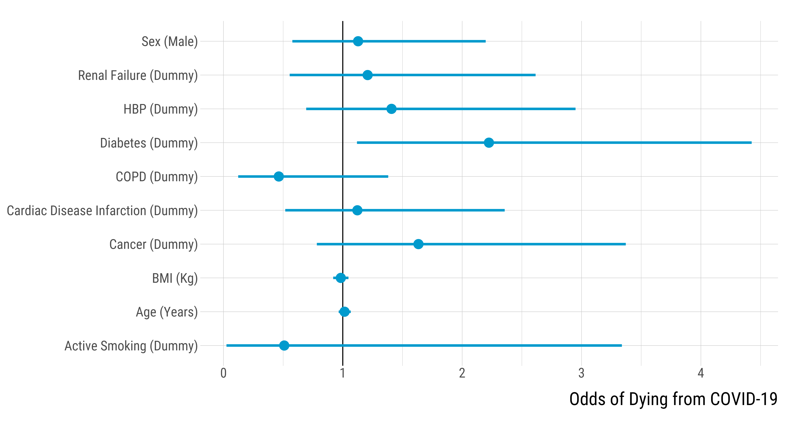

<style>
body {
text-align: justify}
</style>


This script explores the relationship between COVID mortality and comorbidities. Should you have any questions or find coding errors, please do not hesitate to reach me at **leo.zabrocki@psemail.eu**.

# Required Packages and Loading Data

To reproduce exactly the `script_mortality_comorbidities.html` document, you first need to have installed:

* the [R](https://www.r-project.org/) programming language on your computer 
* [RStudio](https://rstudio.com/), an integrated development environment for R, which will allow you to knit the `script_mortality_comorbidities.Rmd` file and interact with the R code chunks
* the [R Markdown](https://rmarkdown.rstudio.com/) package
* and the [Distill](https://rstudio.github.io/distill/) package which provides the template of this document. 

Once everything is set up, we need to load the following packages:

<div class="layout-chunk" data-layout="l-body-outset">
<div class="sourceCode"><pre class="sourceCode r"><code class="sourceCode r"><span class='co'># load required packages</span>
<span class='kw'><a href='https://rdrr.io/r/base/library.html'>library</a></span><span class='op'>(</span><span class='va'><a href='https://github.com/rstudio/rmarkdown'>rmarkdown</a></span><span class='op'>)</span> <span class='co'># for creating the R Markdown document</span>
<span class='kw'><a href='https://rdrr.io/r/base/library.html'>library</a></span><span class='op'>(</span><span class='va'><a href='https://yihui.org/knitr/'>knitr</a></span><span class='op'>)</span> <span class='co'># for creating the R Markdown document</span>
<span class='kw'><a href='https://rdrr.io/r/base/library.html'>library</a></span><span class='op'>(</span><span class='va'><a href='https://here.r-lib.org/'>here</a></span><span class='op'>)</span> <span class='co'># for files paths organization</span>
<span class='kw'><a href='https://rdrr.io/r/base/library.html'>library</a></span><span class='op'>(</span><span class='va'><a href='https://tidyverse.tidyverse.org'>tidyverse</a></span><span class='op'>)</span> <span class='co'># for data manipulation and visualization</span>
<span class='kw'><a href='https://rdrr.io/r/base/library.html'>library</a></span><span class='op'>(</span><span class='va'><a href='http://www.rforge.net/Cairo/'>Cairo</a></span><span class='op'>)</span> <span class='co'># for printing customed police of graphs</span>
</code></pre></div>

</div>


We also load our customed `ggplot2` theme for graphs:

<div class="layout-chunk" data-layout="l-body-outset">
<div class="sourceCode"><pre class="sourceCode r"><code class="sourceCode r"><span class='co'># load ggplot customed theme</span>
<span class='kw'><a href='https://rdrr.io/r/base/source.html'>source</a></span><span class='op'>(</span>
  <span class='fu'>here</span><span class='fu'>::</span><span class='fu'><a href='https://here.r-lib.org//reference/here.html'>here</a></span><span class='op'>(</span>
    <span class='st'>"2.scripts"</span>,
    <span class='st'>"4.custom_ggplot2_theme"</span>,
    <span class='st'>"script_custom_ggplot_theme.R"</span>
  <span class='op'>)</span>
<span class='op'>)</span>
</code></pre></div>

</div>


The theme is based on the fantastic [hrbrthemes](https://hrbrmstr.github.io/hrbrthemes/index.html) package. If you do not want to use this theme or are unable to install it because of fonts issues, you can use the `theme_mimimal()` included in the `ggplot2` package.

We finally load the data we use in our analysis:

<div class="layout-chunk" data-layout="l-body-outset">
<div class="sourceCode"><pre class="sourceCode r"><code class="sourceCode r"><span class='va'>data</span> <span class='op'>&lt;-</span>
  <span class='fu'><a href='https://rdrr.io/r/base/readRDS.html'>readRDS</a></span><span class='op'>(</span><span class='fu'>here</span><span class='fu'>::</span><span class='fu'><a href='https://here.r-lib.org//reference/here.html'>here</a></span><span class='op'>(</span><span class='st'>"1.data"</span>, <span class='st'>"3.data_for_analysis"</span>, <span class='st'>"data_analysis.rds"</span><span class='op'>)</span><span class='op'>)</span>
</code></pre></div>

</div>


We keep patients that were COVID-positive:

<div class="layout-chunk" data-layout="l-body-outset">
<div class="sourceCode"><pre class="sourceCode r"><code class="sourceCode r"><span class='va'>data</span> <span class='op'>&lt;-</span> <span class='va'>data</span> <span class='op'>%&gt;%</span>
  <span class='fu'><a href='https://rdrr.io/r/stats/filter.html'>filter</a></span><span class='op'>(</span><span class='va'>covid</span> <span class='op'>==</span> <span class='fl'>1</span><span class='op'>)</span> <span class='op'>%&gt;%</span>
  <span class='fu'>dplyr</span><span class='fu'>::</span><span class='fu'><a href='https://dplyr.tidyverse.org/reference/select.html'>select</a></span><span class='op'>(</span><span class='op'>-</span><span class='va'>covid</span><span class='op'>)</span>
</code></pre></div>

</div>


We select patients with non-missing observations for the following variables:

<div class="layout-chunk" data-layout="l-body-outset">
<div class="sourceCode"><pre class="sourceCode r"><code class="sourceCode r"><span class='va'>data</span> <span class='op'>&lt;-</span> <span class='va'>data</span> <span class='op'>%&gt;%</span>
  <span class='fu'>dplyr</span><span class='fu'>::</span><span class='fu'><a href='https://dplyr.tidyverse.org/reference/select.html'>select</a></span><span class='op'>(</span>
    <span class='va'>dead</span>,
    <span class='va'>sex</span>,
    <span class='va'>age</span>,
    <span class='va'>bmi</span>,
    <span class='va'>diabetes</span>,
    <span class='va'>hbp</span>,
    <span class='va'>active_smoking</span>,
    <span class='va'>copd</span>,
    <span class='va'>cardiac_disease_infarction</span>,
    <span class='va'>renal_failure</span>,
    <span class='va'>cancer</span>,
    <span class='va'>city</span>
  <span class='op'>)</span> <span class='op'>%&gt;%</span>
  <span class='fu'>drop_na</span><span class='op'>(</span><span class='op'>)</span>
</code></pre></div>

</div>

      
There are 249 observations.

# Statistical Analysis

We run a simple logistic model to estimate the association of each patient's characteristic with the probability of dying from the COVID:

<div class="layout-chunk" data-layout="l-body-outset">
<div class="sourceCode"><pre class="sourceCode r"><code class="sourceCode r"><span class='va'>data_regression_analysis</span> <span class='op'>&lt;-</span> <span class='va'>data</span> <span class='op'>%&gt;%</span>
  <span class='fu'><a href='https://rdrr.io/r/stats/glm.html'>glm</a></span><span class='op'>(</span>
    <span class='va'>dead</span> <span class='op'>~</span>  <span class='va'>sex</span> <span class='op'>+</span>
      <span class='va'>age</span> <span class='op'>+</span>
      <span class='va'>bmi</span> <span class='op'>+</span>
      <span class='va'>active_smoking</span> <span class='op'>+</span>
      <span class='va'>diabetes</span> <span class='op'>+</span>
      <span class='va'>hbp</span> <span class='op'>+</span>
      <span class='va'>copd</span> <span class='op'>+</span>
      <span class='va'>cardiac_disease_infarction</span> <span class='op'>+</span>
      <span class='va'>renal_failure</span> <span class='op'>+</span>
      <span class='va'>cancer</span> <span class='op'>+</span>
      <span class='va'>city</span>,
    family <span class='op'>=</span> <span class='st'>"binomial"</span>,
    data <span class='op'>=</span> <span class='va'>.</span>
  <span class='op'>)</span> <span class='op'>%&gt;%</span>
  <span class='fu'>broom</span><span class='fu'>::</span><span class='fu'><a href='https://generics.r-lib.org/reference/tidy.html'>tidy</a></span><span class='op'>(</span><span class='va'>.</span>, conf.int <span class='op'>=</span> <span class='cn'>TRUE</span><span class='op'>)</span> <span class='op'>%&gt;%</span>
  <span class='fu'>mutate_at</span><span class='op'>(</span><span class='fu'>vars</span><span class='op'>(</span><span class='va'>estimate</span>, <span class='va'>conf.low</span>, <span class='va'>conf.high</span><span class='op'>)</span>, <span class='op'>~</span> <span class='fu'><a href='https://rdrr.io/r/base/Log.html'>exp</a></span><span class='op'>(</span><span class='va'>.</span><span class='op'>)</span><span class='op'>)</span> <span class='op'>%&gt;%</span>
  <span class='fu'>slice</span><span class='op'>(</span><span class='fl'>2</span><span class='op'>:</span><span class='fl'>11</span><span class='op'>)</span> <span class='op'>%&gt;%</span>
  <span class='fu'>mutate</span><span class='op'>(</span>
    term <span class='op'>=</span> <span class='fu'>case_when</span><span class='op'>(</span>
      <span class='va'>term</span> <span class='op'>==</span> <span class='st'>"sexmale"</span> <span class='op'>~</span> <span class='st'>"Sex (Male)"</span>,
      <span class='va'>term</span> <span class='op'>==</span> <span class='st'>"age"</span> <span class='op'>~</span> <span class='st'>"Age (Years)"</span>,
      <span class='va'>term</span> <span class='op'>==</span> <span class='st'>"bmi"</span> <span class='op'>~</span> <span class='st'>"BMI (Kg)"</span>,
      <span class='va'>term</span> <span class='op'>==</span> <span class='st'>"diabetes"</span> <span class='op'>~</span> <span class='st'>"Diabetes (Dummy)"</span>,
      <span class='va'>term</span> <span class='op'>==</span> <span class='st'>"hbp"</span> <span class='op'>~</span> <span class='st'>"HBP (Dummy)"</span>,
      <span class='va'>term</span> <span class='op'>==</span> <span class='st'>"active_smoking"</span> <span class='op'>~</span> <span class='st'>"Active Smoking (Dummy)"</span>,
      <span class='va'>term</span> <span class='op'>==</span> <span class='st'>"copd"</span> <span class='op'>~</span> <span class='st'>"COPD (Dummy)"</span>,
      <span class='va'>term</span> <span class='op'>==</span> <span class='st'>"cardiac_disease_infarction"</span> <span class='op'>~</span> <span class='st'>"Cardiac Disease Infarction (Dummy)"</span>,
      <span class='va'>term</span> <span class='op'>==</span> <span class='st'>"renal_failure"</span> <span class='op'>~</span> <span class='st'>"Renal Failure (Dummy)"</span>,
      <span class='va'>term</span> <span class='op'>==</span> <span class='st'>"cancer"</span> <span class='op'>~</span> <span class='st'>"Cancer (Dummy)"</span>
    <span class='op'>)</span>
  <span class='op'>)</span>
</code></pre></div>

</div>


Graph:

<div class="layout-chunk" data-layout="l-body-outset">
<div class="sourceCode"><pre class="sourceCode r"><code class="sourceCode r"><span class='co'># make the graph</span>
<span class='va'>graph_logistic_mortality_comorbidities</span> <span class='op'>&lt;-</span> <span class='va'>data_regression_analysis</span> <span class='op'>%&gt;%</span>
  <span class='fu'>ggplot</span><span class='op'>(</span><span class='va'>.</span>, <span class='fu'>aes</span><span class='op'>(</span>
    x <span class='op'>=</span> <span class='va'>estimate</span>,
    y <span class='op'>=</span> <span class='va'>term</span>,
    xmin <span class='op'>=</span> <span class='va'>conf.low</span>,
    xmax <span class='op'>=</span> <span class='va'>conf.high</span>
  <span class='op'>)</span><span class='op'>)</span> <span class='op'>+</span>
  <span class='fu'>geom_vline</span><span class='op'>(</span>xintercept <span class='op'>=</span> <span class='fl'>1</span><span class='op'>)</span> <span class='op'>+</span>
  <span class='fu'>geom_pointrange</span><span class='op'>(</span>size <span class='op'>=</span> <span class='fl'>1.2</span>, colour <span class='op'>=</span> <span class='st'>"deepskyblue3"</span><span class='op'>)</span> <span class='op'>+</span>
  <span class='fu'>scale_x_continuous</span><span class='op'>(</span>breaks <span class='op'>=</span> <span class='fu'>scales</span><span class='fu'>::</span><span class='fu'><a href='https://scales.r-lib.org/reference/breaks_pretty.html'>pretty_breaks</a></span><span class='op'>(</span>n <span class='op'>=</span> <span class='fl'>5</span><span class='op'>)</span><span class='op'>)</span> <span class='op'>+</span>
  <span class='fu'>ylab</span><span class='op'>(</span><span class='st'>""</span><span class='op'>)</span> <span class='op'>+</span> <span class='fu'>xlab</span><span class='op'>(</span><span class='st'>"Odds of Dying from COVID-19"</span><span class='op'>)</span> <span class='op'>+</span>
  <span class='va'>custom_theme</span> <span class='op'>+</span>
  <span class='fu'>theme</span><span class='op'>(</span>plot.margin <span class='op'>=</span> <span class='fu'>margin</span><span class='op'>(</span><span class='fl'>1</span>, <span class='fl'>1</span>, <span class='fl'>1</span>,<span class='op'>-</span><span class='fl'>1</span>, <span class='st'>"cm"</span><span class='op'>)</span><span class='op'>)</span>


<span class='co'># print the graph</span>
<span class='va'>graph_logistic_mortality_comorbidities</span>
</code></pre></div>
<!-- --><div class="sourceCode"><pre class="sourceCode r"><code class="sourceCode r"><span class='co'># save graph</span>
<span class='fu'>ggsave</span><span class='op'>(</span>
  <span class='va'>graph_logistic_mortality_comorbidities</span>,
  filename <span class='op'>=</span> <span class='fu'>here</span><span class='fu'>::</span><span class='fu'><a href='https://here.r-lib.org//reference/here.html'>here</a></span><span class='op'>(</span>
    <span class='st'>"3.outputs"</span>,
    <span class='st'>"1.figures"</span>,
    <span class='st'>"1.study_mortality_comorbidities"</span>,
    <span class='st'>"graph_logistic_mortality_comorbidities.pdf"</span>
  <span class='op'>)</span>,
  width <span class='op'>=</span> <span class='fl'>30</span>,
  height <span class='op'>=</span> <span class='fl'>15</span>,
  units <span class='op'>=</span> <span class='st'>"cm"</span>,
  device <span class='op'>=</span> <span class='va'>cairo_pdf</span>
<span class='op'>)</span>
</code></pre></div>

</div>


Table:

<div class="layout-chunk" data-layout="l-body-outset">
<div class="sourceCode"><pre class="sourceCode r"><code class="sourceCode r"><span class='co'># print the table</span>
<span class='va'>data_regression_analysis</span> <span class='op'>%&gt;%</span>
  <span class='fu'>select</span><span class='op'>(</span><span class='va'>term</span>, <span class='va'>estimate</span>, <span class='va'>conf.low</span>, <span class='va'>conf.high</span><span class='op'>)</span> <span class='op'>%&gt;%</span>
  <span class='fu'>mutate_at</span><span class='op'>(</span><span class='fu'>vars</span><span class='op'>(</span><span class='va'>estimate</span><span class='op'>:</span><span class='va'>conf.high</span><span class='op'>)</span>, <span class='op'>~</span> <span class='fu'><a href='https://rdrr.io/r/base/Round.html'>round</a></span><span class='op'>(</span><span class='va'>.</span>, <span class='fl'>1</span><span class='op'>)</span><span class='op'>)</span> <span class='op'>%&gt;%</span>
  <span class='fu'>rename</span><span class='op'>(</span>
    <span class='st'>"Variable"</span> <span class='op'>=</span> <span class='va'>term</span>,
    <span class='st'>"Point Estimate"</span> <span class='op'>=</span> <span class='va'>estimate</span>,
    <span class='st'>"Lower Bound 95% CI"</span> <span class='op'>=</span> <span class='va'>conf.low</span>,
    <span class='st'>"Upper Bound 95% CI"</span> <span class='op'>=</span> <span class='va'>conf.high</span>
  <span class='op'>)</span> <span class='op'>%&gt;%</span>
  <span class='fu'><a href='https://rdrr.io/pkg/knitr/man/kable.html'>kable</a></span><span class='op'>(</span>align <span class='op'>=</span> <span class='fu'><a href='https://rdrr.io/r/base/c.html'>c</a></span><span class='op'>(</span><span class='st'>"l"</span>, <span class='fu'><a href='https://rdrr.io/r/base/rep.html'>rep</a></span><span class='op'>(</span><span class='st'>"c"</span>, <span class='fl'>3</span><span class='op'>)</span><span class='op'>)</span><span class='op'>)</span>
</code></pre></div>


|Variable                           | Point Estimate | Lower Bound 95% CI | Upper Bound 95% CI |
|:----------------------------------|:--------------:|:------------------:|:------------------:|
|Sex (Male)                         |      1.1       |        0.6         |        2.2         |
|Age (Years)                        |      1.0       |        1.0         |        1.1         |
|BMI (Kg)                           |      1.0       |        0.9         |        1.0         |
|Active Smoking (Dummy)             |      0.5       |        0.0         |        3.3         |
|Diabetes (Dummy)                   |      2.2       |        1.1         |        4.4         |
|HBP (Dummy)                        |      1.4       |        0.7         |        2.9         |
|COPD (Dummy)                       |      0.5       |        0.1         |        1.4         |
|Cardiac Disease Infarction (Dummy) |      1.1       |        0.5         |        2.4         |
|Renal Failure (Dummy)              |      1.2       |        0.6         |        2.6         |
|Cancer (Dummy)                     |      1.6       |        0.8         |        3.4         |

</div>


```{.r .distill-force-highlighting-css}
```
