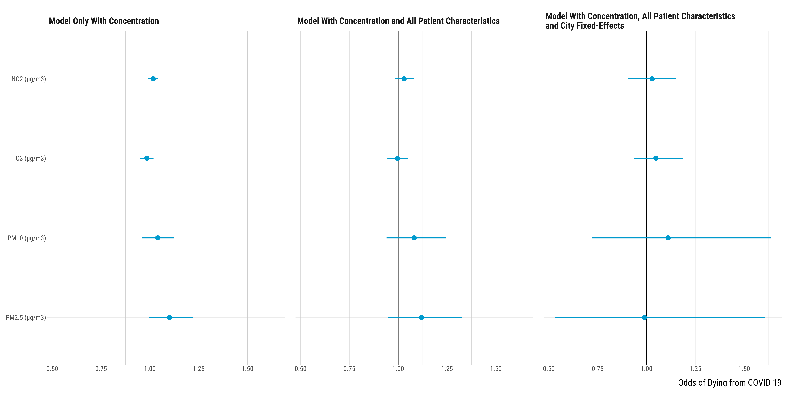
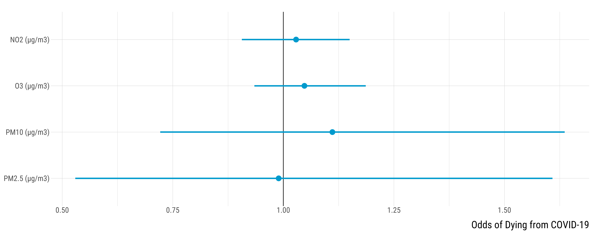

<style>
body {
text-align: justify}
</style>


In this document, we explore the relationship between long-term air pollution exposure and COVID-19 mortality. Should you have any questions or find coding errors, please do not hesitate to reach me at **leo.zabrocki@psemail.eu**.

# Required Packages and Loading Data

To reproduce exactly the `script_mortality_long_term_air_pollution.html` document, you first need to have installed:

* the [R](https://www.r-project.org/) programming language on your computer 
* [RStudio](https://rstudio.com/), an integrated development environment for R, which will allow you to knit the `script_mortality_long_term_air_pollution.Rmd` file and interact with the R code chunks
* the [R Markdown](https://rmarkdown.rstudio.com/) package
* and the [Distill](https://rstudio.github.io/distill/) package which provides the template of this document. 

Once everything is set up, we need to load the following packages:

<div class="layout-chunk" data-layout="l-body-outset">
<div class="sourceCode"><pre class="sourceCode r"><code class="sourceCode r"><span class='co'># load required packages</span>
<span class='kw'><a href='https://rdrr.io/r/base/library.html'>library</a></span><span class='op'>(</span><span class='va'><a href='https://github.com/rstudio/rmarkdown'>rmarkdown</a></span><span class='op'>)</span> <span class='co'># for creating the R Markdown document</span>
<span class='kw'><a href='https://rdrr.io/r/base/library.html'>library</a></span><span class='op'>(</span><span class='va'><a href='https://yihui.org/knitr/'>knitr</a></span><span class='op'>)</span> <span class='co'># for creating the R Markdown document</span>
<span class='kw'><a href='https://rdrr.io/r/base/library.html'>library</a></span><span class='op'>(</span><span class='va'><a href='https://here.r-lib.org/'>here</a></span><span class='op'>)</span> <span class='co'># for files paths organization</span>
<span class='kw'><a href='https://rdrr.io/r/base/library.html'>library</a></span><span class='op'>(</span><span class='va'><a href='https://tidyverse.tidyverse.org'>tidyverse</a></span><span class='op'>)</span> <span class='co'># for data manipulation and visualization</span>
<span class='kw'><a href='https://rdrr.io/r/base/library.html'>library</a></span><span class='op'>(</span><span class='va'><a href='https://modelr.tidyverse.org'>modelr</a></span><span class='op'>)</span>     <span class='co'># provides easy pipeline modeling functions</span>
<span class='kw'><a href='https://rdrr.io/r/base/library.html'>library</a></span><span class='op'>(</span><span class='va'><a href='https://broom.tidymodels.org/'>broom</a></span><span class='op'>)</span>      <span class='co'># helps to tidy up model outputs</span>
<span class='kw'><a href='https://rdrr.io/r/base/library.html'>library</a></span><span class='op'>(</span><span class='va'><a href='https://lubridate.tidyverse.org'>lubridate</a></span><span class='op'>)</span> <span class='co'># for manipulating date variables</span>
<span class='kw'><a href='https://rdrr.io/r/base/library.html'>library</a></span><span class='op'>(</span><span class='va'><a href='http://www.rforge.net/Cairo/'>Cairo</a></span><span class='op'>)</span> <span class='co'># for printing customed police of graphs</span>
</code></pre></div>

</div>


We also load our custom `ggplot2` theme for graphs:

<div class="layout-chunk" data-layout="l-body-outset">
<div class="sourceCode"><pre class="sourceCode r"><code class="sourceCode r"><span class='co'># load ggplot custom theme</span>
<span class='kw'><a href='https://rdrr.io/r/base/source.html'>source</a></span><span class='op'>(</span>
  <span class='fu'>here</span><span class='fu'>::</span><span class='fu'><a href='https://here.r-lib.org//reference/here.html'>here</a></span><span class='op'>(</span>
    <span class='st'>"2.scripts"</span>,
    <span class='st'>"4.custom_ggplot2_theme"</span>,
    <span class='st'>"script_custom_ggplot_theme.R"</span>
  <span class='op'>)</span>
<span class='op'>)</span>
</code></pre></div>

</div>


The theme is based on the fantastic [hrbrthemes](https://hrbrmstr.github.io/hrbrthemes/index.html) package. If you do not want to use this theme or are unable to install it because of fonts issues, you can use the `theme_mimimal()` included in the `ggplot2` package.

We load the data we use in our analysis:

<div class="layout-chunk" data-layout="l-body-outset">
<div class="sourceCode"><pre class="sourceCode r"><code class="sourceCode r"><span class='co'># load data</span>
<span class='va'>data</span> <span class='op'>&lt;-</span>
  <span class='fu'><a href='https://rdrr.io/r/base/readRDS.html'>readRDS</a></span><span class='op'>(</span><span class='fu'>here</span><span class='fu'>::</span><span class='fu'><a href='https://here.r-lib.org//reference/here.html'>here</a></span><span class='op'>(</span><span class='st'>"1.data"</span>, <span class='st'>"3.data_for_analysis"</span>, <span class='st'>"data_analysis.rds"</span><span class='op'>)</span><span class='op'>)</span>
</code></pre></div>

</div>


# Data Wrangling

We select the relevant variables:

<div class="layout-chunk" data-layout="l-body-outset">
<div class="sourceCode"><pre class="sourceCode r"><code class="sourceCode r"><span class='va'>data</span> <span class='op'>&lt;-</span> <span class='va'>data</span> <span class='op'>%&gt;%</span>
  <span class='fu'>dplyr</span><span class='fu'>::</span><span class='fu'><a href='https://dplyr.tidyverse.org/reference/select.html'>select</a></span><span class='op'>(</span>
    <span class='va'>city</span>,
    <span class='va'>patient_id</span>,
    <span class='va'>covid</span><span class='op'>:</span><span class='va'>cancer</span>,
    <span class='va'>mean_2017_2019_no2</span><span class='op'>:</span><span class='va'>mean_2017_2019_so2</span>,
    <span class='va'>mean_2017_2019_average_temperature</span>,
    <span class='va'>mean_2017_2019_relative_humidity</span>
  <span class='op'>)</span>
</code></pre></div>

</div>


We keep patients that were COVID-positive:

<div class="layout-chunk" data-layout="l-body-outset">
<div class="sourceCode"><pre class="sourceCode r"><code class="sourceCode r"><span class='va'>data</span> <span class='op'>&lt;-</span> <span class='va'>data</span> <span class='op'>%&gt;%</span>
  <span class='fu'><a href='https://rdrr.io/r/stats/filter.html'>filter</a></span><span class='op'>(</span><span class='va'>covid</span> <span class='op'>==</span> <span class='fl'>1</span><span class='op'>)</span> <span class='op'>%&gt;%</span>
  <span class='fu'>dplyr</span><span class='fu'>::</span><span class='fu'><a href='https://dplyr.tidyverse.org/reference/select.html'>select</a></span><span class='op'>(</span><span class='op'>-</span><span class='va'>covid</span><span class='op'>)</span>
</code></pre></div>

</div>


# Logistic Regression Analysis

Models:

<div class="layout-chunk" data-layout="l-body-outset">
<div class="sourceCode"><pre class="sourceCode r"><code class="sourceCode r"><span class='va'>data_regression_analysis</span> <span class='op'>&lt;-</span> <span class='va'>data</span> <span class='op'>%&gt;%</span>
  <span class='fu'>pivot_longer</span><span class='op'>(</span>
    cols <span class='op'>=</span> <span class='fu'><a href='https://rdrr.io/r/base/c.html'>c</a></span><span class='op'>(</span><span class='va'>mean_2017_2019_no2</span><span class='op'>:</span><span class='va'>mean_2017_2019_pm2p5</span><span class='op'>)</span>,
    names_to <span class='op'>=</span> <span class='st'>"pollutant"</span>,
    values_to <span class='op'>=</span> <span class='st'>"concentration"</span>
  <span class='op'>)</span> <span class='op'>%&gt;%</span>
  <span class='fu'>group_by</span><span class='op'>(</span><span class='va'>pollutant</span><span class='op'>)</span> <span class='op'>%&gt;%</span>
  <span class='fu'>nest</span><span class='op'>(</span><span class='op'>)</span>

<span class='va'>data_regression_analysis</span> <span class='op'>&lt;-</span> <span class='va'>data_regression_analysis</span> <span class='op'>%&gt;%</span>
  <span class='fu'>mutate</span><span class='op'>(</span>
    <span class='co'># model with only concentration</span>
    `Model Only With Concentration` <span class='op'>=</span> <span class='fu'>map</span><span class='op'>(</span><span class='va'>data</span>, <span class='op'>~</span> <span class='fu'><a href='https://rdrr.io/r/stats/glm.html'>glm</a></span><span class='op'>(</span><span class='va'>dead</span> <span class='op'>~</span> <span class='va'>concentration</span>, family <span class='op'>=</span> <span class='st'>"binomial"</span>,
                                                         data <span class='op'>=</span> <span class='va'>.</span><span class='op'>)</span><span class='op'>)</span>,
    <span class='co'># model with concentration, city and all patient characteristics</span>
    `Model With Concentration, All Patient Characteristics\nand City Fixed-Effects` <span class='op'>=</span> <span class='fu'>map</span><span class='op'>(</span>
      <span class='va'>data</span>,
      <span class='op'>~</span> <span class='fu'><a href='https://rdrr.io/r/stats/glm.html'>glm</a></span><span class='op'>(</span>
        <span class='va'>dead</span> <span class='op'>~</span> <span class='va'>concentration</span> <span class='op'>+</span>
          <span class='va'>sex</span> <span class='op'>+</span>
          <span class='va'>age</span> <span class='op'>+</span>
          <span class='va'>bmi</span> <span class='op'>+</span>
          <span class='va'>diabetes</span> <span class='op'>+</span>
          <span class='va'>hbp</span> <span class='op'>+</span>
          <span class='va'>copd</span> <span class='op'>+</span>
          <span class='va'>cardiac_disease_infarction</span> <span class='op'>+</span>
          <span class='va'>renal_failure</span> <span class='op'>+</span>
          <span class='va'>cancer</span> <span class='op'>+</span>
          <span class='va'>city</span>,
        family <span class='op'>=</span> <span class='st'>"binomial"</span>,
        data <span class='op'>=</span> <span class='va'>.</span>
      <span class='op'>)</span>
    <span class='op'>)</span>,
    <span class='co'># model with concentration, all patient characteristics but without city</span>
    `Model With Concentration and All Patient Characteristics` <span class='op'>=</span> <span class='fu'>map</span><span class='op'>(</span>
      <span class='va'>data</span>,
      <span class='op'>~</span> <span class='fu'><a href='https://rdrr.io/r/stats/glm.html'>glm</a></span><span class='op'>(</span>
        <span class='va'>dead</span> <span class='op'>~</span> <span class='va'>concentration</span> <span class='op'>+</span>
          <span class='va'>sex</span> <span class='op'>+</span>
          <span class='va'>age</span> <span class='op'>+</span>
          <span class='va'>bmi</span> <span class='op'>+</span>
          <span class='va'>diabetes</span> <span class='op'>+</span>
          <span class='va'>hbp</span> <span class='op'>+</span>
          <span class='va'>copd</span> <span class='op'>+</span>
          <span class='va'>cardiac_disease_infarction</span> <span class='op'>+</span>
          <span class='va'>renal_failure</span> <span class='op'>+</span>
          <span class='va'>cancer</span>,
        family <span class='op'>=</span> <span class='st'>"binomial"</span>,
        data <span class='op'>=</span> <span class='va'>.</span>
      <span class='op'>)</span>
    <span class='op'>)</span>
  <span class='op'>)</span>

<span class='co'># transform in long according to models</span>
<span class='va'>data_regression_analysis</span> <span class='op'>&lt;-</span> <span class='va'>data_regression_analysis</span> <span class='op'>%&gt;%</span>
  <span class='fu'>pivot_longer</span><span class='op'>(</span>
    cols <span class='op'>=</span> <span class='fu'><a href='https://rdrr.io/r/base/c.html'>c</a></span><span class='op'>(</span>
      <span class='va'>`Model Only With Concentration`</span><span class='op'>:</span><span class='va'>`Model With Concentration and All Patient Characteristics`</span>
    <span class='op'>)</span>,
    names_to <span class='op'>=</span> <span class='st'>"model"</span>,
    values_to <span class='op'>=</span> <span class='st'>"coefficients"</span>
  <span class='op'>)</span> <span class='op'>%&gt;%</span>
  <span class='fu'>dplyr</span><span class='fu'>::</span><span class='fu'><a href='https://dplyr.tidyverse.org/reference/select.html'>select</a></span><span class='op'>(</span><span class='op'>-</span><span class='va'>data</span><span class='op'>)</span>

<span class='co'># tidy regression ouputs</span>
<span class='va'>data_regression_analysis</span> <span class='op'>&lt;-</span> <span class='va'>data_regression_analysis</span> <span class='op'>%&gt;%</span>
  <span class='fu'>mutate</span><span class='op'>(</span>models_dfs <span class='op'>=</span> <span class='fu'>map</span><span class='op'>(</span><span class='va'>coefficients</span>, <span class='op'>~</span> <span class='fu'>broom</span><span class='fu'>::</span><span class='fu'><a href='https://generics.r-lib.org/reference/tidy.html'>tidy</a></span><span class='op'>(</span><span class='va'>.</span>, conf.int <span class='op'>=</span> <span class='cn'>TRUE</span><span class='op'>)</span><span class='op'>)</span><span class='op'>)</span>

<span class='co'># unnest results and select coefficient for total gross tonnage</span>
<span class='va'>data_regression_analysis</span> <span class='op'>&lt;-</span> <span class='va'>data_regression_analysis</span> <span class='op'>%&gt;%</span>
  <span class='fu'>unnest</span><span class='op'>(</span><span class='va'>models_dfs</span><span class='op'>)</span> <span class='op'>%&gt;%</span>
  <span class='fu'>dplyr</span><span class='fu'>::</span><span class='fu'><a href='https://dplyr.tidyverse.org/reference/filter.html'>filter</a></span><span class='op'>(</span><span class='va'>term</span> <span class='op'>==</span> <span class='st'>"concentration"</span><span class='op'>)</span>

<span class='co'># exponentiate</span>
<span class='va'>data_regression_analysis</span> <span class='op'>&lt;-</span> <span class='va'>data_regression_analysis</span> <span class='op'>%&gt;%</span>
  <span class='fu'>mutate_at</span><span class='op'>(</span><span class='fu'>vars</span><span class='op'>(</span><span class='va'>estimate</span>, <span class='va'>conf.low</span>, <span class='va'>conf.high</span><span class='op'>)</span>, <span class='op'>~</span> <span class='fu'><a href='https://rdrr.io/r/base/Log.html'>exp</a></span><span class='op'>(</span><span class='va'>.</span><span class='op'>)</span><span class='op'>)</span>
</code></pre></div>

</div>


Graph for the three models:

<div class="layout-chunk" data-layout="l-body-outset">
<div class="sourceCode"><pre class="sourceCode r"><code class="sourceCode r"><span class='co'># make the graph</span>
<span class='va'>graph_mortality_air_pollution_all_models</span> <span class='op'>&lt;-</span> <span class='va'>data_regression_analysis</span> <span class='op'>%&gt;%</span>
  <span class='fu'>mutate</span><span class='op'>(</span>
    pollutant <span class='op'>=</span> <span class='fu'>case_when</span><span class='op'>(</span>
      <span class='va'>pollutant</span> <span class='op'>==</span> <span class='st'>"mean_2017_2019_no2"</span> <span class='op'>~</span> <span class='st'>"NO2 (µg/m3)"</span>,
      <span class='va'>pollutant</span> <span class='op'>==</span> <span class='st'>"mean_2017_2019_o3"</span> <span class='op'>~</span> <span class='st'>"O3 (µg/m3)"</span>,
      <span class='va'>pollutant</span> <span class='op'>==</span> <span class='st'>"mean_2017_2019_pm10"</span> <span class='op'>~</span> <span class='st'>"PM10 (µg/m3)"</span>,
      <span class='va'>pollutant</span> <span class='op'>==</span> <span class='st'>"mean_2017_2019_pm2p5"</span> <span class='op'>~</span> <span class='st'>"PM2.5 (µg/m3)"</span>,
      <span class='va'>pollutant</span> <span class='op'>==</span> <span class='st'>"mean_2017_2019_so2"</span> <span class='op'>~</span> <span class='st'>"SO2 (µg/m3)"</span>
    <span class='op'>)</span>
  <span class='op'>)</span> <span class='op'>%&gt;%</span>
  <span class='fu'>mutate</span><span class='op'>(</span>
    model <span class='op'>=</span> <span class='fu'>fct_relevel</span><span class='op'>(</span>
      <span class='va'>model</span>,
      <span class='st'>"Model Only With Concentration"</span>,
      <span class='st'>"Model With Concentration and All Patient Characteristics"</span>,
      <span class='st'>"Model With Concentration, All Patient Characteristics\nand City Fixed-Effects"</span><span class='op'>)</span>
  <span class='op'>)</span> <span class='op'>%&gt;%</span>
  <span class='fu'>ggplot</span><span class='op'>(</span><span class='va'>.</span>, <span class='fu'>aes</span><span class='op'>(</span>
    x <span class='op'>=</span> <span class='va'>estimate</span>,
    y <span class='op'>=</span> <span class='fu'>fct_rev</span><span class='op'>(</span><span class='va'>pollutant</span><span class='op'>)</span>,
    xmin <span class='op'>=</span> <span class='va'>conf.low</span>,
    xmax <span class='op'>=</span> <span class='va'>conf.high</span>
  <span class='op'>)</span><span class='op'>)</span> <span class='op'>+</span>
  <span class='fu'>geom_vline</span><span class='op'>(</span>xintercept <span class='op'>=</span> <span class='fl'>1</span><span class='op'>)</span> <span class='op'>+</span>
  <span class='fu'>geom_pointrange</span><span class='op'>(</span>size <span class='op'>=</span> <span class='fl'>1.2</span>, colour <span class='op'>=</span> <span class='st'>"deepskyblue3"</span><span class='op'>)</span> <span class='op'>+</span>
  <span class='fu'>facet_wrap</span><span class='op'>(</span> <span class='op'>~</span> <span class='va'>model</span>, nrow <span class='op'>=</span> <span class='fl'>1</span><span class='op'>)</span> <span class='op'>+</span>
  <span class='fu'>ylab</span><span class='op'>(</span><span class='st'>""</span><span class='op'>)</span> <span class='op'>+</span> <span class='fu'>xlab</span><span class='op'>(</span><span class='st'>"Odds of Dying from COVID-19"</span><span class='op'>)</span> <span class='op'>+</span>
  <span class='va'>custom_theme</span> <span class='op'>+</span>
  <span class='fu'>theme</span><span class='op'>(</span>plot.margin <span class='op'>=</span> <span class='fu'>margin</span><span class='op'>(</span><span class='fl'>1</span>, <span class='fl'>1</span>, <span class='fl'>1</span>, <span class='op'>-</span><span class='fl'>1</span>, <span class='st'>"cm"</span><span class='op'>)</span><span class='op'>)</span>


<span class='co'># print the graph</span>
<span class='va'>graph_mortality_air_pollution_all_models</span>
</code></pre></div>
<!-- --><div class="sourceCode"><pre class="sourceCode r"><code class="sourceCode r"><span class='co'># save graph</span>
<span class='fu'>ggsave</span><span class='op'>(</span><span class='va'>graph_mortality_air_pollution_all_models</span>, filename <span class='op'>=</span> <span class='fu'>here</span><span class='fu'>::</span><span class='fu'><a href='https://here.r-lib.org//reference/here.html'>here</a></span><span class='op'>(</span><span class='st'>"3.outputs"</span>, <span class='st'>"1.figures"</span>, <span class='st'>"3.study_mortality_long_term_air_pollution"</span>, <span class='st'>"graph_mortality_air_pollution_all_models.pdf"</span><span class='op'>)</span>, 
       width <span class='op'>=</span> <span class='fl'>60</span>, height <span class='op'>=</span> <span class='fl'>15</span>, units <span class='op'>=</span> <span class='st'>"cm"</span>, device <span class='op'>=</span> <span class='va'>cairo_pdf</span><span class='op'>)</span>
</code></pre></div>

</div>


Graph for the full model:

<div class="layout-chunk" data-layout="l-body-outset">
<div class="sourceCode"><pre class="sourceCode r"><code class="sourceCode r"><span class='co'># make the graph</span>
<span class='va'>graph_mortality_air_pollution_full_model</span> <span class='op'>&lt;-</span> <span class='va'>data_regression_analysis</span> <span class='op'>%&gt;%</span>
  <span class='fu'>mutate</span><span class='op'>(</span>
    pollutant <span class='op'>=</span> <span class='fu'>case_when</span><span class='op'>(</span>
      <span class='va'>pollutant</span> <span class='op'>==</span> <span class='st'>"mean_2017_2019_no2"</span> <span class='op'>~</span> <span class='st'>"NO2 (µg/m3)"</span>,
      <span class='va'>pollutant</span> <span class='op'>==</span> <span class='st'>"mean_2017_2019_o3"</span> <span class='op'>~</span> <span class='st'>"O3 (µg/m3)"</span>,
      <span class='va'>pollutant</span> <span class='op'>==</span> <span class='st'>"mean_2017_2019_pm10"</span> <span class='op'>~</span> <span class='st'>"PM10 (µg/m3)"</span>,
      <span class='va'>pollutant</span> <span class='op'>==</span> <span class='st'>"mean_2017_2019_pm2p5"</span> <span class='op'>~</span> <span class='st'>"PM2.5 (µg/m3)"</span>,
      <span class='va'>pollutant</span> <span class='op'>==</span> <span class='st'>"mean_2017_2019_so2"</span> <span class='op'>~</span> <span class='st'>"SO2 (µg/m3)"</span>
    <span class='op'>)</span>
  <span class='op'>)</span> <span class='op'>%&gt;%</span>
  <span class='fu'><a href='https://rdrr.io/r/stats/filter.html'>filter</a></span><span class='op'>(</span><span class='va'>model</span> <span class='op'>==</span> <span class='st'>"Model With Concentration, All Patient Characteristics\nand City Fixed-Effects"</span><span class='op'>)</span> <span class='op'>%&gt;%</span>
  <span class='fu'>ggplot</span><span class='op'>(</span><span class='va'>.</span>, <span class='fu'>aes</span><span class='op'>(</span>
    x <span class='op'>=</span> <span class='va'>estimate</span>,
    y <span class='op'>=</span> <span class='fu'>fct_rev</span><span class='op'>(</span><span class='va'>pollutant</span><span class='op'>)</span>,
    xmin <span class='op'>=</span> <span class='va'>conf.low</span>,
    xmax <span class='op'>=</span> <span class='va'>conf.high</span>
  <span class='op'>)</span><span class='op'>)</span> <span class='op'>+</span>
  <span class='fu'>geom_vline</span><span class='op'>(</span>xintercept <span class='op'>=</span> <span class='fl'>1</span><span class='op'>)</span> <span class='op'>+</span>
  <span class='fu'>geom_pointrange</span><span class='op'>(</span>size <span class='op'>=</span> <span class='fl'>1.2</span>, colour <span class='op'>=</span> <span class='st'>"deepskyblue3"</span><span class='op'>)</span> <span class='op'>+</span>
  <span class='fu'>ylab</span><span class='op'>(</span><span class='st'>""</span><span class='op'>)</span> <span class='op'>+</span> <span class='fu'>xlab</span><span class='op'>(</span><span class='st'>"Odds of Dying from COVID-19"</span><span class='op'>)</span> <span class='op'>+</span>
  <span class='va'>custom_theme</span> <span class='op'>+</span>
  <span class='fu'>theme</span><span class='op'>(</span>plot.margin <span class='op'>=</span> <span class='fu'>margin</span><span class='op'>(</span><span class='fl'>1</span>, <span class='fl'>1</span>, <span class='fl'>1</span>, <span class='op'>-</span><span class='fl'>1</span>, <span class='st'>"cm"</span><span class='op'>)</span><span class='op'>)</span>


<span class='co'># print the graph</span>
<span class='va'>graph_mortality_air_pollution_full_model</span>
</code></pre></div>
<!-- --><div class="sourceCode"><pre class="sourceCode r"><code class="sourceCode r"><span class='co'># save graph</span>
<span class='fu'>ggsave</span><span class='op'>(</span><span class='va'>graph_mortality_air_pollution_full_model</span>, filename <span class='op'>=</span> <span class='fu'>here</span><span class='fu'>::</span><span class='fu'><a href='https://here.r-lib.org//reference/here.html'>here</a></span><span class='op'>(</span><span class='st'>"3.outputs"</span>, <span class='st'>"1.figures"</span>, <span class='st'>"3.study_mortality_long_term_air_pollution"</span>, <span class='st'>"graph_mortality_air_pollution_full_model.pdf"</span><span class='op'>)</span>, 
       width <span class='op'>=</span> <span class='fl'>30</span>, height <span class='op'>=</span> <span class='fl'>15</span>, units <span class='op'>=</span> <span class='st'>"cm"</span>, device <span class='op'>=</span> <span class='va'>cairo_pdf</span><span class='op'>)</span>
</code></pre></div>

</div>


Table for the full model:

<div class="layout-chunk" data-layout="l-body-outset">
<div class="sourceCode"><pre class="sourceCode r"><code class="sourceCode r"><span class='co'># print the table</span>
<span class='va'>data_regression_analysis</span> <span class='op'>%&gt;%</span>
  <span class='fu'>mutate</span><span class='op'>(</span>
    pollutant <span class='op'>=</span> <span class='fu'>case_when</span><span class='op'>(</span>
      <span class='va'>pollutant</span> <span class='op'>==</span> <span class='st'>"mean_2017_2019_no2"</span> <span class='op'>~</span> <span class='st'>"NO2 (µg/m3)"</span>,
      <span class='va'>pollutant</span> <span class='op'>==</span> <span class='st'>"mean_2017_2019_o3"</span> <span class='op'>~</span> <span class='st'>"O3 (µg/m3)"</span>,
      <span class='va'>pollutant</span> <span class='op'>==</span> <span class='st'>"mean_2017_2019_pm10"</span> <span class='op'>~</span> <span class='st'>"PM10 (µg/m3)"</span>,
      <span class='va'>pollutant</span> <span class='op'>==</span> <span class='st'>"mean_2017_2019_pm2p5"</span> <span class='op'>~</span> <span class='st'>"PM2.5 (µg/m3)"</span>,
      <span class='va'>pollutant</span> <span class='op'>==</span> <span class='st'>"mean_2017_2019_so2"</span> <span class='op'>~</span> <span class='st'>"SO2 (µg/m3)"</span>
    <span class='op'>)</span>
  <span class='op'>)</span> <span class='op'>%&gt;%</span>
  <span class='fu'><a href='https://rdrr.io/r/stats/filter.html'>filter</a></span><span class='op'>(</span><span class='va'>model</span> <span class='op'>==</span> <span class='st'>"Model With Concentration, All Patient Characteristics\nand City Fixed-Effects"</span><span class='op'>)</span> <span class='op'>%&gt;%</span>
  <span class='fu'>dplyr</span><span class='fu'>::</span><span class='fu'><a href='https://dplyr.tidyverse.org/reference/select.html'>select</a></span><span class='op'>(</span><span class='va'>pollutant</span>, <span class='va'>estimate</span>, <span class='va'>conf.low</span>, <span class='va'>conf.high</span><span class='op'>)</span> <span class='op'>%&gt;%</span>
  <span class='fu'>mutate_at</span><span class='op'>(</span><span class='fu'>vars</span><span class='op'>(</span><span class='va'>estimate</span><span class='op'>:</span><span class='va'>conf.high</span><span class='op'>)</span>, <span class='op'>~</span> <span class='fu'><a href='https://rdrr.io/r/base/Round.html'>round</a></span><span class='op'>(</span><span class='va'>.</span>, <span class='fl'>2</span><span class='op'>)</span><span class='op'>)</span> <span class='op'>%&gt;%</span>
  <span class='fu'>rename</span><span class='op'>(</span><span class='st'>"Pollutant"</span> <span class='op'>=</span> <span class='va'>pollutant</span>, <span class='st'>"Point Estimate"</span> <span class='op'>=</span> <span class='va'>estimate</span>, <span class='st'>"Lower Bound 95% CI"</span> <span class='op'>=</span> <span class='va'>conf.low</span>, <span class='st'>"Upper Bound 95% CI"</span> <span class='op'>=</span> <span class='va'>conf.high</span><span class='op'>)</span> <span class='op'>%&gt;%</span>
  <span class='fu'><a href='https://rdrr.io/pkg/knitr/man/kable.html'>kable</a></span><span class='op'>(</span>align <span class='op'>=</span> <span class='fu'><a href='https://rdrr.io/r/base/c.html'>c</a></span><span class='op'>(</span><span class='st'>"l"</span>, <span class='st'>"l"</span>, <span class='fu'><a href='https://rdrr.io/r/base/rep.html'>rep</a></span><span class='op'>(</span><span class='st'>"c"</span>, <span class='fl'>3</span><span class='op'>)</span><span class='op'>)</span><span class='op'>)</span>
</code></pre></div>


|Pollutant     |Point Estimate | Lower Bound 95% CI | Upper Bound 95% CI |
|:-------------|:--------------|:------------------:|:------------------:|
|NO2 (µg/m3)   |1.03           |        0.91        |        1.15        |
|O3 (µg/m3)    |1.05           |        0.93        |        1.19        |
|PM10 (µg/m3)  |1.11           |        0.72        |        1.64        |
|PM2.5 (µg/m3) |0.99           |        0.53        |        1.61        |

</div>

```{.r .distill-force-highlighting-css}
```
