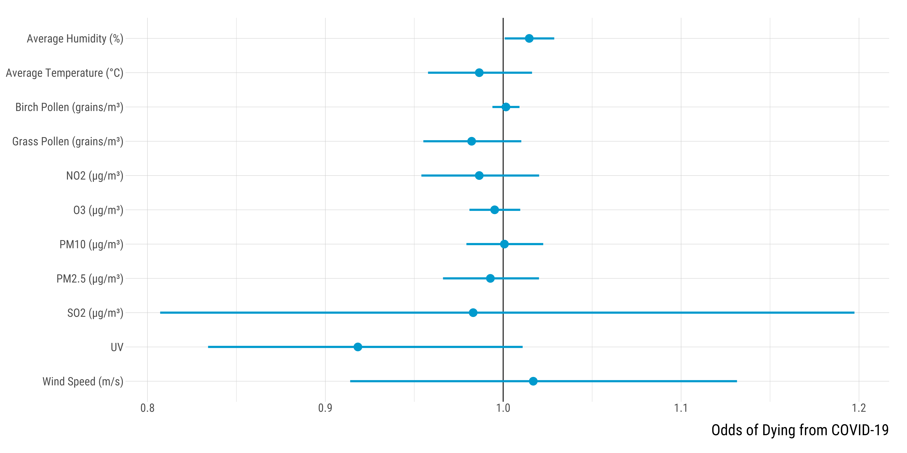

<style>
body {
text-align: justify}
</style>


In this document, we explore the relationship between short-term environmental factors exposure (averaged the 20 days before the PCR test) and COVID-19 mortality. Should you have any questions or find coding errors, please do not hesitate to reach me at **leo.zabrocki@psemail.eu**.

# Required Packages and Loading Data

To reproduce exactly the `script_mortality_short_term_environmental_exposure.html` document, you first need to have installed:

* the [R](https://www.r-project.org/) programming language on your computer 
* [RStudio](https://rstudio.com/), an integrated development environment for R, which will allow you to knit the `script_mortality_short_term_environmental_exposure.Rmd` file and interact with the R code chunks
* the [R Markdown](https://rmarkdown.rstudio.com/) package
* and the [Distill](https://rstudio.github.io/distill/) package which provides the template of this document. 

Once everything is set up, we need to load the following packages:

<div class="layout-chunk" data-layout="l-body-outset">
<div class="sourceCode"><pre class="sourceCode r"><code class="sourceCode r"><span class='co'># load required packages</span>
<span class='kw'><a href='https://rdrr.io/r/base/library.html'>library</a></span><span class='op'>(</span><span class='va'><a href='https://github.com/rstudio/rmarkdown'>rmarkdown</a></span><span class='op'>)</span> <span class='co'># for creating the R Markdown document</span>
<span class='kw'><a href='https://rdrr.io/r/base/library.html'>library</a></span><span class='op'>(</span><span class='va'><a href='https://yihui.org/knitr/'>knitr</a></span><span class='op'>)</span> <span class='co'># for creating the R Markdown document</span>
<span class='kw'><a href='https://rdrr.io/r/base/library.html'>library</a></span><span class='op'>(</span><span class='va'><a href='https://here.r-lib.org/'>here</a></span><span class='op'>)</span> <span class='co'># for files paths organization</span>
<span class='kw'><a href='https://rdrr.io/r/base/library.html'>library</a></span><span class='op'>(</span><span class='va'><a href='https://tidyverse.tidyverse.org'>tidyverse</a></span><span class='op'>)</span> <span class='co'># for data manipulation and visualization</span>
<span class='kw'><a href='https://rdrr.io/r/base/library.html'>library</a></span><span class='op'>(</span><span class='va'><a href='https://modelr.tidyverse.org'>modelr</a></span><span class='op'>)</span> <span class='co'># provides easy pipeline modeling functions</span>
<span class='kw'><a href='https://rdrr.io/r/base/library.html'>library</a></span><span class='op'>(</span><span class='va'><a href='https://broom.tidymodels.org/'>broom</a></span><span class='op'>)</span> <span class='co'># helps to tidy up model outputs</span>
<span class='kw'><a href='https://rdrr.io/r/base/library.html'>library</a></span><span class='op'>(</span><span class='va'><a href='https://lubridate.tidyverse.org'>lubridate</a></span><span class='op'>)</span> <span class='co'># for manipulating date variables</span>
<span class='kw'><a href='https://rdrr.io/r/base/library.html'>library</a></span><span class='op'>(</span><span class='va'><a href='http://www.rforge.net/Cairo/'>Cairo</a></span><span class='op'>)</span> <span class='co'># for printing customed police of graphs</span>
</code></pre></div>

</div>


We also load our custom `ggplot2` theme for graphs:

<div class="layout-chunk" data-layout="l-body-outset">
<div class="sourceCode"><pre class="sourceCode r"><code class="sourceCode r"><span class='co'># load ggplot custom theme</span>
<span class='kw'><a href='https://rdrr.io/r/base/source.html'>source</a></span><span class='op'>(</span>
  <span class='fu'>here</span><span class='fu'>::</span><span class='fu'><a href='https://here.r-lib.org//reference/here.html'>here</a></span><span class='op'>(</span>
    <span class='st'>"2.scripts"</span>,
    <span class='st'>"4.custom_ggplot2_theme"</span>,
    <span class='st'>"script_custom_ggplot_theme.R"</span>
  <span class='op'>)</span>
<span class='op'>)</span>
</code></pre></div>

</div>


The theme is based on the fantastic [hrbrthemes](https://hrbrmstr.github.io/hrbrthemes/index.html) package. If you do not want to use this theme or are unable to install it because of fonts issues, you can use the `theme_mimimal()` included in the `ggplot2` package.

We load the data we use in our analysis:

<div class="layout-chunk" data-layout="l-body-outset">
<div class="sourceCode"><pre class="sourceCode r"><code class="sourceCode r"><span class='va'>data</span> <span class='op'>&lt;-</span>
  <span class='fu'><a href='https://rdrr.io/r/base/readRDS.html'>readRDS</a></span><span class='op'>(</span><span class='fu'>here</span><span class='fu'>::</span><span class='fu'><a href='https://here.r-lib.org//reference/here.html'>here</a></span><span class='op'>(</span><span class='st'>"1.data"</span>, <span class='st'>"3.data_for_analysis"</span>, <span class='st'>"data_analysis.rds"</span><span class='op'>)</span><span class='op'>)</span>
</code></pre></div>

</div>


# Data Wrangling

### Data Cleaning

We select the relevant variables:

<div class="layout-chunk" data-layout="l-body-outset">
<div class="sourceCode"><pre class="sourceCode r"><code class="sourceCode r"><span class='va'>data</span> <span class='op'>&lt;-</span> <span class='va'>data</span> <span class='op'>%&gt;%</span>
  <span class='fu'>mutate</span><span class='op'>(</span>month <span class='op'>=</span> <span class='fu'>lubridate</span><span class='fu'>::</span><span class='fu'><a href='http://lubridate.tidyverse.org/reference/month.html'>month</a></span><span class='op'>(</span><span class='va'>date_pcr_test</span><span class='op'>)</span> <span class='op'>%&gt;%</span> <span class='fu'><a href='https://rdrr.io/r/base/factor.html'>as.factor</a></span><span class='op'>(</span><span class='va'>.</span><span class='op'>)</span><span class='op'>)</span> <span class='op'>%&gt;%</span>
  <span class='fu'>dplyr</span><span class='fu'>::</span><span class='fu'><a href='https://dplyr.tidyverse.org/reference/select.html'>select</a></span><span class='op'>(</span>
    <span class='va'>city</span>,
    <span class='va'>patient_id</span>,
    <span class='va'>month</span>,
    <span class='va'>covid</span><span class='op'>:</span><span class='va'>cancer</span>,
    <span class='va'>no2_lag_20</span><span class='op'>:</span><span class='va'>wind_speed_lag_0</span>,
    <span class='va'>uvi_lag_20</span><span class='op'>:</span><span class='va'>olive_lag_0</span>
  <span class='op'>)</span>
</code></pre></div>

</div>


We keep patients that were COVID-positive:

<div class="layout-chunk" data-layout="l-body-outset">
<div class="sourceCode"><pre class="sourceCode r"><code class="sourceCode r"><span class='va'>data</span> <span class='op'>&lt;-</span> <span class='va'>data</span> <span class='op'>%&gt;%</span>
  <span class='fu'><a href='https://rdrr.io/r/stats/filter.html'>filter</a></span><span class='op'>(</span><span class='va'>covid</span> <span class='op'>==</span> <span class='fl'>1</span><span class='op'>)</span> <span class='op'>%&gt;%</span>
  <span class='fu'>dplyr</span><span class='fu'>::</span><span class='fu'><a href='https://dplyr.tidyverse.org/reference/select.html'>select</a></span><span class='op'>(</span><span class='op'>-</span><span class='va'>covid</span><span class='op'>)</span>
</code></pre></div>

</div>


We compute the average exposure for an environmental factor over 20 days before the PCR test:

<div class="layout-chunk" data-layout="l-body-outset">
<div class="sourceCode"><pre class="sourceCode r"><code class="sourceCode r"><span class='co'># compute average of short-term exposure</span>
<span class='va'>data_short_term_exposure</span> <span class='op'>&lt;-</span> <span class='va'>data</span> <span class='op'>%&gt;%</span>
  <span class='fu'>select</span><span class='op'>(</span><span class='va'>patient_id</span>, <span class='va'>no2_lag_20</span><span class='op'>:</span><span class='va'>olive_lag_0</span><span class='op'>)</span> <span class='op'>%&gt;%</span>
  <span class='fu'>pivot_longer</span><span class='op'>(</span>
    cols <span class='op'>=</span> <span class='fu'><a href='https://rdrr.io/r/base/c.html'>c</a></span><span class='op'>(</span><span class='va'>no2_lag_20</span><span class='op'>:</span><span class='va'>olive_lag_0</span><span class='op'>)</span>,
    names_to <span class='op'>=</span> <span class='st'>"exposure_lag"</span>,
    values_to <span class='op'>=</span> <span class='st'>"value"</span>
  <span class='op'>)</span> <span class='op'>%&gt;%</span>
  <span class='fu'>mutate</span><span class='op'>(</span>
    exposure <span class='op'>=</span> <span class='fu'>case_when</span><span class='op'>(</span>
      <span class='fu'>str_detect</span><span class='op'>(</span><span class='va'>exposure_lag</span>, <span class='st'>"no2"</span><span class='op'>)</span> <span class='op'>~</span> <span class='st'>"NO2 (µg/m³)"</span>,
      <span class='fu'>str_detect</span><span class='op'>(</span><span class='va'>exposure_lag</span>, <span class='st'>"o3"</span><span class='op'>)</span> <span class='op'>~</span> <span class='st'>"O3 (µg/m³)"</span>,
      <span class='fu'>str_detect</span><span class='op'>(</span><span class='va'>exposure_lag</span>, <span class='st'>"pm10"</span><span class='op'>)</span> <span class='op'>~</span> <span class='st'>"PM10 (µg/m³)"</span>,
      <span class='fu'>str_detect</span><span class='op'>(</span><span class='va'>exposure_lag</span>, <span class='st'>"pm2p5"</span><span class='op'>)</span> <span class='op'>~</span> <span class='st'>"PM2.5 (µg/m³)"</span>,
      <span class='fu'>str_detect</span><span class='op'>(</span><span class='va'>exposure_lag</span>, <span class='st'>"so2"</span><span class='op'>)</span> <span class='op'>~</span> <span class='st'>"SO2 (µg/m³)"</span>,
      <span class='fu'>str_detect</span><span class='op'>(</span><span class='va'>exposure_lag</span>, <span class='st'>"temperature"</span><span class='op'>)</span> <span class='op'>~</span> <span class='st'>"Average Temperature (°C)"</span>,
      <span class='fu'>str_detect</span><span class='op'>(</span><span class='va'>exposure_lag</span>, <span class='st'>"humidity"</span><span class='op'>)</span> <span class='op'>~</span> <span class='st'>"Average Humidity (%)"</span>,
      <span class='fu'>str_detect</span><span class='op'>(</span><span class='va'>exposure_lag</span>, <span class='st'>"wind"</span><span class='op'>)</span> <span class='op'>~</span> <span class='st'>"Wind Speed (m/s)"</span>,
      <span class='fu'>str_detect</span><span class='op'>(</span><span class='va'>exposure_lag</span>, <span class='st'>"uvi"</span><span class='op'>)</span> <span class='op'>~</span> <span class='st'>"UV"</span>,
      <span class='fu'>str_detect</span><span class='op'>(</span><span class='va'>exposure_lag</span>, <span class='st'>"birch"</span><span class='op'>)</span> <span class='op'>~</span> <span class='st'>"Birch Pollen (grains/m³)"</span>,
      <span class='fu'>str_detect</span><span class='op'>(</span><span class='va'>exposure_lag</span>, <span class='st'>"grass"</span><span class='op'>)</span> <span class='op'>~</span> <span class='st'>"Grass Pollen (grains/m³)"</span>,
      <span class='fu'>str_detect</span><span class='op'>(</span><span class='va'>exposure_lag</span>, <span class='st'>"olive"</span><span class='op'>)</span> <span class='op'>~</span> <span class='st'>"Olive Pollen (grains/m³)"</span>
    <span class='op'>)</span>
  <span class='op'>)</span> <span class='op'>%&gt;%</span>
  <span class='fu'>group_by</span><span class='op'>(</span><span class='va'>patient_id</span>, <span class='va'>exposure</span><span class='op'>)</span> <span class='op'>%&gt;%</span>
  <span class='fu'>summarise</span><span class='op'>(</span>mean_exposure <span class='op'>=</span> <span class='fu'><a href='https://rdrr.io/r/base/mean.html'>mean</a></span><span class='op'>(</span><span class='va'>value</span><span class='op'>)</span><span class='op'>)</span> <span class='op'>%&gt;%</span>
  <span class='fu'>pivot_wider</span><span class='op'>(</span>names_from <span class='op'>=</span> <span class='va'>exposure</span>, values_from <span class='op'>=</span> <span class='va'>mean_exposure</span><span class='op'>)</span>
</code></pre></div>

</div>


We merge back these exposures with the inital data:

<div class="layout-chunk" data-layout="l-body-outset">
<div class="sourceCode"><pre class="sourceCode r"><code class="sourceCode r"><span class='va'>data</span> <span class='op'>&lt;-</span> <span class='va'>data</span> <span class='op'>%&gt;%</span>
  <span class='fu'>select</span><span class='op'>(</span><span class='va'>city</span><span class='op'>:</span><span class='va'>cancer</span><span class='op'>)</span> <span class='op'>%&gt;%</span>
  <span class='fu'>left_join</span><span class='op'>(</span><span class='va'>.</span>, <span class='va'>data_short_term_exposure</span>, by <span class='op'>=</span> <span class='st'>"patient_id"</span><span class='op'>)</span>
</code></pre></div>

</div>


# Logistic Regression Analysis

We run our multivariate logistic regression model:

<div class="layout-chunk" data-layout="l-body-outset">
<div class="sourceCode"><pre class="sourceCode r"><code class="sourceCode r"><span class='va'>data_regression_analysis</span> <span class='op'>&lt;-</span> <span class='va'>data</span> <span class='op'>%&gt;%</span>
  <span class='fu'>pivot_longer</span><span class='op'>(</span>
    cols <span class='op'>=</span> <span class='fu'><a href='https://rdrr.io/r/base/c.html'>c</a></span><span class='op'>(</span><span class='va'>`Average Humidity (%)`</span><span class='op'>:</span><span class='va'>`Wind Speed (m/s)`</span><span class='op'>)</span>,
    names_to <span class='op'>=</span> <span class='st'>"exposure"</span>,
    values_to <span class='op'>=</span> <span class='st'>"exposure_value"</span>
  <span class='op'>)</span> <span class='op'>%&gt;%</span>
  <span class='fu'>group_by</span><span class='op'>(</span><span class='va'>exposure</span><span class='op'>)</span> <span class='op'>%&gt;%</span>
  <span class='fu'>nest</span><span class='op'>(</span><span class='op'>)</span>

<span class='va'>data_regression_analysis</span> <span class='op'>&lt;-</span> <span class='va'>data_regression_analysis</span> <span class='op'>%&gt;%</span>
  <span class='fu'>mutate</span><span class='op'>(</span>
    <span class='co'># model</span>
    model<span class='op'>=</span> <span class='fu'>map</span><span class='op'>(</span>
      <span class='va'>data</span>,
      <span class='op'>~</span> <span class='fu'><a href='https://rdrr.io/r/stats/glm.html'>glm</a></span><span class='op'>(</span>
        <span class='va'>dead</span> <span class='op'>~</span> <span class='va'>exposure_value</span> <span class='op'>+</span>
          <span class='va'>sex</span> <span class='op'>+</span>
          <span class='va'>age</span> <span class='op'>+</span>
          <span class='va'>bmi</span> <span class='op'>+</span>
          <span class='va'>diabetes</span> <span class='op'>+</span>
          <span class='va'>hbp</span> <span class='op'>+</span>
          <span class='va'>copd</span> <span class='op'>+</span>
          <span class='va'>cardiac_disease_infarction</span> <span class='op'>+</span>
          <span class='va'>renal_failure</span> <span class='op'>+</span>
          <span class='va'>cancer</span> <span class='op'>+</span>
          <span class='va'>month</span> <span class='op'>+</span>
          <span class='va'>city</span>,
        data <span class='op'>=</span> <span class='va'>.</span>
      <span class='op'>)</span>
    <span class='op'>)</span>
  <span class='op'>)</span>

<span class='co'># tidy regression ouputs</span>
<span class='va'>data_regression_analysis</span> <span class='op'>&lt;-</span> <span class='va'>data_regression_analysis</span> <span class='op'>%&gt;%</span>
  <span class='fu'>select</span><span class='op'>(</span><span class='op'>-</span><span class='va'>data</span><span class='op'>)</span> <span class='op'>%&gt;%</span>
  <span class='fu'>mutate</span><span class='op'>(</span>models_dfs <span class='op'>=</span> <span class='fu'>map</span><span class='op'>(</span><span class='va'>model</span>, <span class='op'>~</span> <span class='fu'>broom</span><span class='fu'>::</span><span class='fu'><a href='https://generics.r-lib.org/reference/tidy.html'>tidy</a></span><span class='op'>(</span><span class='va'>.</span>, conf.int <span class='op'>=</span> <span class='cn'>TRUE</span><span class='op'>)</span><span class='op'>)</span><span class='op'>)</span>

<span class='co'># unnest results and select coefficient</span>
<span class='va'>data_regression_analysis</span> <span class='op'>&lt;-</span> <span class='va'>data_regression_analysis</span> <span class='op'>%&gt;%</span>
  <span class='fu'>unnest</span><span class='op'>(</span><span class='va'>models_dfs</span><span class='op'>)</span> <span class='op'>%&gt;%</span>
  <span class='fu'>dplyr</span><span class='fu'>::</span><span class='fu'><a href='https://dplyr.tidyverse.org/reference/filter.html'>filter</a></span><span class='op'>(</span><span class='va'>term</span> <span class='op'>==</span> <span class='st'>"exposure_value"</span><span class='op'>)</span>

<span class='co'># exponentiate</span>
<span class='va'>data_regression_analysis</span> <span class='op'>&lt;-</span> <span class='va'>data_regression_analysis</span> <span class='op'>%&gt;%</span>
  <span class='fu'>mutate_at</span><span class='op'>(</span><span class='fu'>vars</span><span class='op'>(</span><span class='va'>estimate</span>, <span class='va'>conf.low</span>, <span class='va'>conf.high</span><span class='op'>)</span>, <span class='op'>~</span> <span class='fu'><a href='https://rdrr.io/r/base/Log.html'>exp</a></span><span class='op'>(</span><span class='va'>.</span><span class='op'>)</span><span class='op'>)</span>
</code></pre></div>

</div>


We graphically display point estimates and their associated 95% confidence intervals:

<div class="layout-chunk" data-layout="l-body-outset">
<div class="sourceCode"><pre class="sourceCode r"><code class="sourceCode r"><span class='co'># make the graph</span>
<span class='va'>graph_logistic_all_cities</span> <span class='op'>&lt;-</span> <span class='va'>data_regression_analysis</span> <span class='op'>%&gt;%</span>
  <span class='fu'><a href='https://rdrr.io/r/stats/filter.html'>filter</a></span><span class='op'>(</span><span class='va'>exposure</span> <span class='op'>!=</span> <span class='st'>"Olive Pollen (grains/m³)"</span><span class='op'>)</span> <span class='op'>%&gt;%</span>
  <span class='fu'>ggplot</span><span class='op'>(</span><span class='va'>.</span>, <span class='fu'>aes</span><span class='op'>(</span>
    x <span class='op'>=</span> <span class='va'>estimate</span>,
    y <span class='op'>=</span> <span class='fu'>fct_rev</span><span class='op'>(</span><span class='va'>exposure</span><span class='op'>)</span>,
    xmin <span class='op'>=</span> <span class='va'>conf.low</span>,
    xmax <span class='op'>=</span> <span class='va'>conf.high</span>
  <span class='op'>)</span><span class='op'>)</span> <span class='op'>+</span>
  <span class='fu'>geom_vline</span><span class='op'>(</span>xintercept <span class='op'>=</span> <span class='fl'>1</span><span class='op'>)</span> <span class='op'>+</span>
  <span class='fu'>geom_pointrange</span><span class='op'>(</span>size <span class='op'>=</span> <span class='fl'>1.2</span>, colour <span class='op'>=</span> <span class='st'>"deepskyblue3"</span><span class='op'>)</span> <span class='op'>+</span>
  <span class='fu'>ylab</span><span class='op'>(</span><span class='st'>""</span><span class='op'>)</span> <span class='op'>+</span> <span class='fu'>xlab</span><span class='op'>(</span><span class='st'>"Odds of Dying from COVID-19"</span><span class='op'>)</span> <span class='op'>+</span>
  <span class='va'>custom_theme</span> <span class='op'>+</span>
  <span class='fu'>theme</span><span class='op'>(</span>plot.margin <span class='op'>=</span> <span class='fu'>margin</span><span class='op'>(</span><span class='fl'>1</span>, <span class='fl'>1</span>, <span class='fl'>1</span>, <span class='op'>-</span><span class='fl'>1</span>, <span class='st'>"cm"</span><span class='op'>)</span><span class='op'>)</span>


<span class='co'># print the graph</span>
<span class='va'>graph_logistic_all_cities</span>
</code></pre></div>
<!-- --><div class="sourceCode"><pre class="sourceCode r"><code class="sourceCode r"><span class='co'># save graph</span>
<span class='fu'>ggsave</span><span class='op'>(</span><span class='va'>graph_logistic_all_cities</span>, filename <span class='op'>=</span> <span class='fu'>here</span><span class='fu'>::</span><span class='fu'><a href='https://here.r-lib.org//reference/here.html'>here</a></span><span class='op'>(</span><span class='st'>"3.outputs"</span>, <span class='st'>"1.figures"</span>, <span class='st'>"4.study_mortality_short_term_environmental_exposure"</span>, <span class='st'>"graph_mortality_short_term_environmental_exposure.pdf"</span><span class='op'>)</span>, 
       width <span class='op'>=</span> <span class='fl'>30</span>, height <span class='op'>=</span> <span class='fl'>20</span>, units <span class='op'>=</span> <span class='st'>"cm"</span>, device <span class='op'>=</span> <span class='va'>cairo_pdf</span><span class='op'>)</span>
</code></pre></div>

</div>


We display values of point estimates and their associated 95% confidence intervals in the table below:

<div class="layout-chunk" data-layout="l-body-outset">
<div class="sourceCode"><pre class="sourceCode r"><code class="sourceCode r"><span class='co'># print the table</span>
<span class='fu'><a href='https://rdrr.io/r/base/options.html'>options</a></span><span class='op'>(</span>scipen <span class='op'>=</span> <span class='fl'>100</span><span class='op'>)</span>

<span class='va'>data_regression_analysis</span> <span class='op'>%&gt;%</span>
  <span class='fu'><a href='https://rdrr.io/r/stats/filter.html'>filter</a></span><span class='op'>(</span><span class='va'>exposure</span> <span class='op'>!=</span> <span class='st'>"Olive Pollen (grains/m³)"</span><span class='op'>)</span> <span class='op'>%&gt;%</span>
  <span class='fu'>select</span><span class='op'>(</span><span class='va'>exposure</span>, <span class='va'>estimate</span>, <span class='va'>conf.low</span>, <span class='va'>conf.high</span><span class='op'>)</span> <span class='op'>%&gt;%</span>
  <span class='fu'>mutate_at</span><span class='op'>(</span><span class='fu'>vars</span><span class='op'>(</span><span class='va'>estimate</span><span class='op'>:</span><span class='va'>conf.high</span><span class='op'>)</span>, <span class='op'>~</span> <span class='fu'><a href='https://rdrr.io/r/base/Round.html'>round</a></span><span class='op'>(</span><span class='va'>.</span>, <span class='fl'>2</span><span class='op'>)</span><span class='op'>)</span> <span class='op'>%&gt;%</span>
  <span class='fu'>rename</span><span class='op'>(</span><span class='st'>"Exposure"</span> <span class='op'>=</span> <span class='va'>exposure</span>, <span class='st'>"Point Estimate"</span> <span class='op'>=</span> <span class='va'>estimate</span>, <span class='st'>"Lower Bound 95% CI"</span> <span class='op'>=</span> <span class='va'>conf.low</span>, <span class='st'>"Upper Bound 95% CI"</span> <span class='op'>=</span> <span class='va'>conf.high</span><span class='op'>)</span> <span class='op'>%&gt;%</span>
  <span class='fu'><a href='https://rdrr.io/pkg/knitr/man/kable.html'>kable</a></span><span class='op'>(</span>align <span class='op'>=</span> <span class='fu'><a href='https://rdrr.io/r/base/c.html'>c</a></span><span class='op'>(</span><span class='st'>"l"</span>, <span class='fu'><a href='https://rdrr.io/r/base/rep.html'>rep</a></span><span class='op'>(</span><span class='st'>"c"</span>, <span class='fl'>3</span><span class='op'>)</span><span class='op'>)</span><span class='op'>)</span>
</code></pre></div>


|Exposure                 | Point Estimate | Lower Bound 95% CI | Upper Bound 95% CI |
|:------------------------|:--------------:|:------------------:|:------------------:|
|Average Humidity (%)     |      1.01      |        1.00        |        1.03        |
|Average Temperature (°C) |      0.99      |        0.96        |        1.02        |
|Birch Pollen (grains/m³) |      1.00      |        0.99        |        1.01        |
|Grass Pollen (grains/m³) |      0.98      |        0.96        |        1.01        |
|NO2 (µg/m³)              |      0.99      |        0.95        |        1.02        |
|O3 (µg/m³)               |      1.00      |        0.98        |        1.01        |
|PM10 (µg/m³)             |      1.00      |        0.98        |        1.02        |
|PM2.5 (µg/m³)            |      0.99      |        0.97        |        1.02        |
|SO2 (µg/m³)              |      0.98      |        0.81        |        1.20        |
|UV                       |      0.92      |        0.83        |        1.01        |
|Wind Speed (m/s)         |      1.02      |        0.91        |        1.13        |

</div>

```{.r .distill-force-highlighting-css}
```
